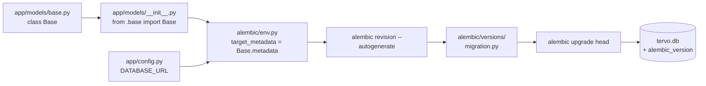

# INT-00 — Initialiser Alembic

> **Objectif** : Mettre en place les migrations de base de données dès le premier jour du projet.
> **Stack** : Python + SQLAlchemy + Alembic + SQLite (dev)

---

## 1. Structure du projet backend

Avant de commencer, voici l'arborescence qu'on a créée pour le backend :

```
backend/
├── app/
│   ├── __init__.py          # Package Python
│   ├── config.py            # Settings (DATABASE_URL, JWT, etc.)
│   ├── core/                # Database engine, security, deps
│   ├── models/
│   │   ├── __init__.py      # Exporte Base (future factory des modèles)
│   │   └── base.py          # declarative_base()
│   ├── schemas/             # Pydantic (validation API)
│   ├── repositories/        # Accès DB (repository pattern)
│   ├── services/            # Logique métier
│   ├── exporters/           # Génération PDF
│   └── api/v1/              # Routes REST
├── alembic/                 # Migrations DB (généré par Alembic)
│   ├── env.py               # Configuration du contexte Alembic
│   ├── script.py.mako       # Template des fichiers de migration
│   └── versions/            # Fichiers de migration générés
├── alembic.ini              # Fichier de configuration Alembic
├── pyproject.toml            # Dépendances Python (uv)
├── uv.lock                  # Lockfile généré par uv sync
└── tervo.db                  # Base SQLite (créée à la 1ère migration)
```

---

## 2. Le fichier `app/config.py` — Les settings

C'est le point d'entrée de toute la configuration de l'application :

```python
from pydantic_settings import BaseSettings

class Settings(BaseSettings):
    # ── Database ──
    DATABASE_URL: str = "sqlite:///./tervo.db"
    # NOTE: "sqlite://" (sync) pour Alembic
    #       "sqlite+aiosqlite://" (async) pour FastAPI

    # ── Auth / JWT ──
    SECRET_KEY: str = "dev-secret-key-change-in-production"
    ALGORITHM: str = "HS256"
    ACCESS_TOKEN_EXPIRE_MINUTES: int = 30
    REFRESH_TOKEN_EXPIRE_DAYS: int = 7

    # ── App metadata ──
    APP_NAME: str = "Tervo"
    APP_VERSION: str = "0.1.0"
    API_V1_PREFIX: str = "/api/v1"

    model_config = {"env_file": ".env", "env_file_encoding": "utf-8"}

settings = Settings()  # Instance globale utilisable partout
```

**Points clés :**
- `pydantic-settings` charge automatiquement les variables depuis un fichier `.env` ou les variables d'environnement
- `DATABASE_URL` utilise **SQLite synchrone** (`sqlite:///`) pour être compatible avec Alembic (qui fonctionne en mode synchrone). L'engine async FastAPI ajoutera `+aiosqlite` au moment de la connexion.
- Les secrets JWT sont en dur en dev, à passer en variables d'environnement en prod.

---

## 3. Le fichier `app/models/base.py` — La Base SQLAlchemy

C'est la classe dont **tous** les modèles vont hériter :

```python
from sqlalchemy.orm import DeclarativeBase

class Base(DeclarativeBase):
    pass
```

**Pourquoi ?** SQLAlchemy 2.0 a deux styles :
- **Style déclaratif** (ancien) : `Base = declarative_base()` (fonction)
- **Style 2.0 Mapped** (nouveau) : `class Base(DeclarativeBase): pass`

On utilise le **style 2.0** car il est plus propre et permet d'utiliser `mapped_column()` plus tard.

---

## 4. Le fichier `app/models/__init__.py` — La factory

```python
from app.models.base import Base

# Les futurs modèles seront importés ici :
# from app.models.user import User   # ← viendra dans INT-01
# from app.models.client import Client  # ← viendra dans INT-04
```

**Pourquoi c'est important ?** Alembic a besoin de connaître **tous** les modèles pour détecter les changements via `--autogenerate`. En les important tous dans `__init__.py`, Alembic peut les découvrir via `Base.metadata`.

---

## 5. Initialisation d'Alembic

### 5.1 Installation des dépendances

```bash
cd backend/
uv venv                        # Création du venv (ultra-rapide)
uv sync                        # Installe depuis pyproject.toml
```

Le fichier `pyproject.toml` (projet PEP 621) contient toutes les dépendances :
- **fastapi, uvicorn** → le framework web
- **sqlalchemy, alembic** → ORM + migrations
- **aiosqlite** → driver SQLite async pour FastAPI
- **pydantic, pydantic-settings** → validation des données
- **python-jose, passlib** → JWT et hash bcrypt
- **pytest, httpx** → tests (groupe dev)

### 5.2 Initialisation d'Alembic

```bash
cd backend/
.venv/bin/alembic init alembic
```

Cette commande crée :
```
alembic.ini           → configuration générale
alembic/env.py        → script Python qui configure le contexte
alembic/script.py.mako → template des fichiers de migration
alembic/versions/     → dossier des migrations générées
```

### 5.3 Configuration de `alembic/env.py`

C'est le fichier le plus important. Il dit à Alembic :
1. **Quels modèles suivre** → `target_metadata = Base.metadata`
2. **Où est la base de données** → `config.set_main_option("sqlalchemy.url", settings.DATABASE_URL)`

```python
from app.config import settings
from app.models.base import Base

# Tous les modèles héritant de Base seront détectés automatiquement
target_metadata = Base.metadata

# On écrase l'URL de la base depuis les settings
config.set_main_option("sqlalchemy.url", settings.DATABASE_URL)
```

**Pourquoi ne pas laisser l'URL dans `alembic.ini` ?** Pour éviter la duplication :
- L'URL est définie **une seule fois** dans `app/config.py`
- `env.py` la lit et la passe à Alembic
- On peut changer de base (SQLite → PostgreSQL) en modifiant juste une variable d'environnement

### 5.4 Création de la première migration

```bash
cd backend/
.venv/bin/alembic revision --autogenerate -m "initial empty schema"
```

Cette commande :
1. **Importe** `env.py` qui charge `Base.metadata`
2. **Compare** `Base.metadata` (nos modèles) avec l'état actuel de la base
3. **Génère** un fichier de migration dans `alembic/versions/`

Comme on n'a pas encore de modèle, la migration est vide :
```python
# alembic/versions/9b55bf942f2a_initial_empty_schema.py
def upgrade() -> None:
    pass  # Rien à migrer encore

def downgrade() -> None:
    pass
```

### 5.5 Application de la migration

```bash
cd backend/
.venv/bin/alembic upgrade head
```

Résultat :
- La base `tervo.db` est créée
- La table `alembic_version` est créée avec la version `9b55bf942f2a`
- Prochaines migrations s'enchaîneront : `9b55bf942f2a → ... → head`

---

## 6. Workflow quotidien des migrations

Une fois Alembic en place, le cycle de vie d'une feature est :

```bash
# 1. Créer/modifier un modèle SQLAlchemy
# 2. L'importer dans app/models/__init__.py
# 3. Générer la migration automatiquement
.venv/bin/alembic revision --autogenerate -m "add user table"

# 4. Vérifier le fichier généré dans alembic/versions/
# 5. Appliquer la migration
.venv/bin/alembic upgrade head
```

---

## 7. Piège évité : SQLite sync vs async

**Problème :** J'avais mis `DATABASE_URL = "sqlite+aiosqlite:///./tervo.db"` (async).

**Erreur :** Alembic fonctionne en **synchrone** et ne peut pas utiliser `aiosqlite`. On obtenait :
```
sqlalchemy.exc.MissingGreenlet: greenlet_spawn has not been called
```

**Solution :** Utiliser `sqlite:///./tervo.db` (sync) dans `DATABASE_URL`. L'engine async pour FastAPI sera configuré séparément dans `app/core/database.py` avec le préfixe `+aiosqlite`.

---

## 8. Commandes utiles

```bash
# Lister l'historique des migrations
.venv/bin/alembic history

# Voir la migration courante
.venv/bin/alembic current

# Revenir en arrière (d'une version)
.venv/bin/alembic downgrade -1

# Revenir au début (base vide)
.venv/bin/alembic downgrade base

# Voir le SQL généré sans l'exécuter (offline mode)
.venv/bin/alembic upgrade head --sql
```

---

## Résumé visuel



