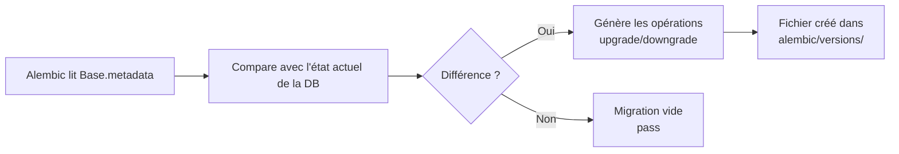

# INT-01 — Modèle User + 1ère migration

> **Objectif** : Créer le premier modèle SQLAlchemy (`User`) et générer la migration automatique
> **Stack** : Python + SQLAlchemy 2.0 ORM + Alembic autogenerate + SQLite

---

## 1. Le modèle `User`

Fichier : `backend/app/models/user.py`

```python
import enum
from sqlalchemy import Boolean, Column, DateTime, Enum, Integer, String, func
from app.models.base import Base


class Role(str, enum.Enum):
    TECHNICIAN = "technician"
    ADMIN = "admin"


class User(Base):
    __tablename__ = "user"          # Attention : "user" est un mot réservé SQL

    id = Column(Integer, primary_key=True, index=True)
    username = Column(String(100), unique=True, nullable=False, index=True)
    email = Column(String(255), unique=True, nullable=False)
    hashed_password = Column(String(255), nullable=False)
    full_name = Column(String(255), nullable=True)
    role = Column(Enum(Role), default=Role.TECHNICIAN, nullable=False)
    is_active = Column(Boolean, default=True, nullable=False)
    created_at = Column(DateTime, server_default=func.now(), nullable=False)
    updated_at = Column(DateTime, server_default=func.now(), onupdate=func.now(), nullable=False)
```

### Points-clés

| Concept                      | Explication                                                                                                                     |
| ---------------------------- | ------------------------------------------------------------------------------------------------------------------------------- |
| `__tablename__ = "user"`     | `user` est un **mot réservé** SQL (ex: `CREATE USER`). On force les guillemets autour du nom de table pour éviter les conflits. |
| `class Role(str, enum.Enum)` | Enum héritant de `str` pour que les valeurs soient stockées en **texte** en base (`VARCHAR`), pas en entier.                    |
| `server_default=func.now()`  | La valeur par défaut est définie **côté base de données** (via `DEFAULT CURRENT_TIMESTAMP`), pas côté Python.                   |
| `onupdate=func.now()`        | Met automatiquement à jour le timestamp à chaque modification de la ligne.                                                      |
| `nullable=False`             | Rend la colonne obligatoire (`NOT NULL` en SQL).                                                                                |

### L'enum `Role`

```python
class Role(str, enum.Enum):
    TECHNICIAN = "technician"   # valeur stockée : "technician"
    ADMIN = "admin"             # valeur stockée : "admin"
```

- Hériter de `str` + `enum.Enum` → SQLAlchemy stocke la **valeur** ("technician"), pas le nom (`TECHNICIAN`)
- SQLAlchemy crée une colonne `VARCHAR(10)` avec un CHECK implicite

### Pourquoi `hashed_password` et pas `password` ?

**Règle de sécurité : on ne stocke JAMAIS un mot de passe en clair.**

- Le client envoie le password en clair → le serveur le **hash** avec bcrypt (`passlib`)
- Seul le hash est stocké dans `hashed_password`
- À la connexion, on compare le hash stocké avec le hash du password fourni

---

## 2. Import dans `models/__init__.py`

Fichier : `backend/app/models/__init__.py`

```python
from app.models.base import Base
from app.models.user import User   # ← NOUVEAU : permet à Alembic de découvrir le modèle
```

**Pourquoi c'est obligatoire ?** Alembic `--autogenerate` fonctionne en analysant `Base.metadata`. Si le modèle `User` n'est pas importé, il n'est pas enregistré dans `Base.metadata`, donc **Alembic ne le voit pas**.

---

## 3. Génération de la migration automatique

```bash
cd backend/
.venv/bin/alembic revision --autogenerate -m "add user table"
```

### Ce que fait `--autogenerate`



### Résultat : le fichier généré

```python
# alembic/versions/24b96d6f9dfa_add_user_table.py

revision = '24b96d6f9dfa'
down_revision = '9b55bf942f2a'      # ← chaîne avec la migration précédente

def upgrade() -> None:
    op.create_table('user',
        sa.Column('id', sa.Integer(), nullable=False),
        sa.Column('username', sa.VARCHAR(length=100), nullable=False),
        sa.Column('email', sa.VARCHAR(length=255), nullable=False),
        sa.Column('hashed_password', sa.VARCHAR(length=255), nullable=False),
        sa.Column('full_name', sa.VARCHAR(length=255), nullable=True),
        sa.Column('role', sa.VARCHAR(length=10), nullable=False),
        sa.Column('is_active', sa.Boolean(), nullable=False),
        sa.Column('created_at', sa.DateTime(), server_default=sa.text('(CURRENT_TIMESTAMP)'), nullable=False),
        sa.Column('updated_at', sa.DateTime(), server_default=sa.text('(CURRENT_TIMESTAMP)'), nullable=False),
        sa.PrimaryKeyConstraint('id'),
        sa.UniqueConstraint('email')
    )
    op.create_index(op.f('ix_user_username'), 'user', ['username'], unique=True)
    op.create_index(op.f('ix_user_id'), 'user', ['id'], unique=False)

def downgrade() -> None:
    op.drop_index(op.f('ix_user_username'), table_name='user')
    op.drop_index(op.f('ix_user_id'), table_name='user')
    op.drop_table('user')
```

**À retenir :**

- `down_revision = '9b55bf942f2a'` → la chaîne de migration : `initale → user`
- `upgrade()` crée la table, les index, les contraintes
- `downgrade()` fait l'inverse (permet de revenir en arrière)

---

## 4. Application de la migration

```bash
.venv/bin/alembic upgrade head
```

### Vérification

```bash
# Voir la version courante
.venv/bin/alembic current
# → 24b96d6f9dfa (head)

# Voir l'historique complet
.venv/bin/alembic history
# → 9b55bf942f2a -> 24b96d6f9dfa (head), add user table
```

### Dans la base SQLite

Requête exécutée :

```sql
SELECT sql FROM sqlite_master WHERE type='table' AND name='user';
```

Résultat :

```sql
CREATE TABLE user (
    id INTEGER NOT NULL,
    username VARCHAR(100) NOT NULL,
    email VARCHAR(255) NOT NULL,
    hashed_password VARCHAR(255) NOT NULL,
    full_name VARCHAR(255),
    role VARCHAR(10) NOT NULL,
    is_active BOOLEAN NOT NULL,
    created_at DATETIME DEFAULT (CURRENT_TIMESTAMP) NOT NULL,
    updated_at DATETIME DEFAULT (CURRENT_TIMESTAMP) NOT NULL,
    PRIMARY KEY (id),
    UNIQUE (email)
)
```

Contraintes et index :

- `UNIQUE (email)` — contrainte inline
- `ix_user_username` — index UNIQUE sur `username`
- `ix_user_id` — index simple sur `id` (créé par `index=True`)

---

## 5. Résumé SQL → ORM

```sql
-- SQL pur
CREATE TABLE "user" (
    id SERIAL PRIMARY KEY,
    username VARCHAR(100) UNIQUE NOT NULL,
    ...
);
```

```python
# SQLAlchemy (Python)
class User(Base):
    __tablename__ = "user"
    id = Column(Integer, primary_key=True)
    username = Column(String(100), unique=True, nullable=False)
```

**Correspondance :**

| SQL                         | SQLAlchemy                  |
| --------------------------- | --------------------------- |
| `SERIAL PRIMARY KEY`        | `Integer, primary_key=True` |
| `VARCHAR(100)`              | `String(100)`               |
| `UNIQUE`                    | `unique=True`               |
| `NOT NULL`                  | `nullable=False`            |
| `DEFAULT 'technician'`      | `default=Role.TECHNICIAN`   |
| `DEFAULT CURRENT_TIMESTAMP` | `server_default=func.now()` |

---

## 6. Workflow complet (à retenir)

```bash
# 1. Créer le modèle dans app/models/ma_table.py
# 2. L'importer dans app/models/__init__.py
# 3. Générer la migration
.venv/bin/alembic revision --autogenerate -m "describe change"

# 4. VÉRIFIER le fichier généré (surtout le downgrade !)
# 5. Appliquer
.venv/bin/alembic upgrade head

# 6. Vérifier
.venv/bin/alembic current
```
