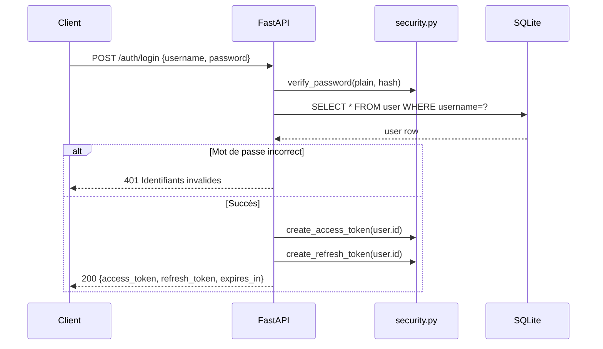
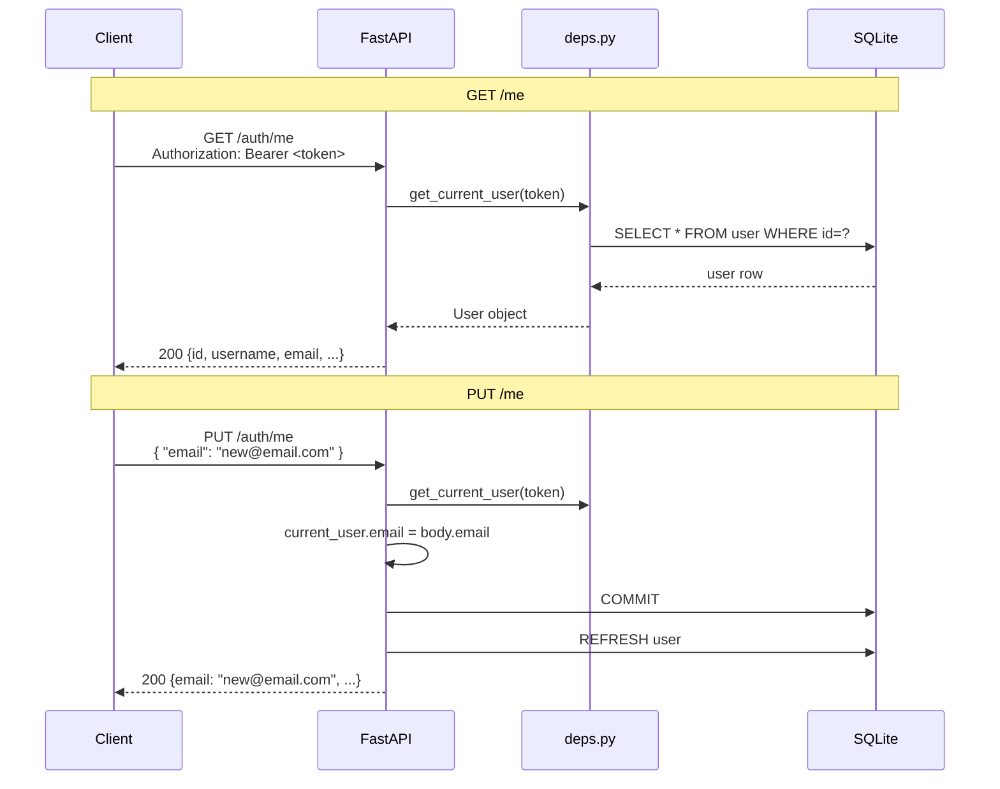

# INT-02 — Auth JWT (login + refresh)

> **Objectif** : Authentifier les techniciens via JWT (Access Token + Refresh Token)
> **Stack** : FastAPI + python-jose (JWT) + passlib/bcrypt (hash) + SQLAlchemy async

---

## 1. Architecture de l'authentification

```mermaid
flowchart LR
    subgraph Client [Client Vue.js]
        A[LoginPage]
    end
    subgraph Backend [Backend FastAPI]
        B[POST /auth/login]
        C[POST /auth/refresh]
        D[GET/PUT /auth/me]
        E[core/security.py]
        F[core/deps.py]
        G[core/database.py]
    end
    subgraph DB [(SQLite)]
        H[user table]
    end

    A --> B
    B --> E
    E --> F
    F --> G
    G --> H
    B --> C
```

---

## 2. Les fichiers créés

| Fichier                | Rôle                                                 |
| ---------------------- | ---------------------------------------------------- |
| `app/core/database.py` | Engine async SQLAlchemy + session factory            |
| `app/core/security.py` | Hash bcrypt + création/vérification JWT              |
| `app/core/deps.py`     | Dépendance `get_current_user` (guard auth)           |
| `app/schemas/auth.py`  | Schemas Pydantic (LoginRequest, TokenResponse, etc.) |
| `app/api/v1/auth.py`   | Routes : POST /login, POST /refresh, GET, PUT /me    |
| `app/main.py`          | Point d'entrée FastAPI (CORS, routers)               |
| `app/seed.py`          | Script de seed pour créer un utilisateur de test     |

---

## 3. `app/core/database.py` — Engine async

```python
from sqlalchemy.ext.asyncio import AsyncSession, async_sessionmaker, create_async_engine

# Conversion sync → async
def _get_async_database_url() -> str:
    if settings.DATABASE_URL.startswith("sqlite"):
        return settings.DATABASE_URL.replace("sqlite://", "sqlite+aiosqlite://", 1)
    # SQLite → sqlite+aiosqlite://
    # PostgreSQL → postgresql+asyncpg://

engine = create_async_engine(_get_async_database_url(), echo=False)
async_session = async_sessionmaker(engine, class_=AsyncSession, expire_on_commit=False)

async def get_db():         # ← FastAPI dependency
    async with async_session() as session:
        yield session       # ← injecté dans les routes
```

**Point clé :** Alembic utilise **sync** (`sqlite://`), FastAPI utilise **async** (`sqlite+aiosqlite://`). La fonction `_get_async_database_url()` transforme l'URL au moment de l'exécution.

---

## 4. `app/core/security.py` — JWT + bcrypt

### Hash bcrypt

```python
from passlib.context import CryptContext

pwd_context = CryptContext(schemes=["bcrypt"], deprecated="auto")

def get_password_hash(password: str) -> str:
    return pwd_context.hash(password)        # → "$2b$12$..."

def verify_password(plain: str, hashed: str) -> bool:
    return pwd_context.verify(plain, hashed)  # → True/False
```

**À retenir :** On ne stocke **jamais** le mot de passe en clair. `passlib` utilise bcrypt pour hasher avec un salt aléatoire.

### JWT

```python
from jose import jwt
from datetime import datetime, timedelta, timezone

def create_access_token(user_id: int) -> str:
    expires = timedelta(minutes=30)
    payload = {
        "sub": str(user_id),          # subject = l'ID de l'utilisateur
        "exp": datetime.now(timezone.utc) + expires,  # expiration
        "iat": datetime.now(timezone.utc),            # émis à
        "type": "access",                              # type de token
    }
    return jwt.encode(payload, SECRET_KEY, algorithm="HS256")

def create_refresh_token(user_id: int) -> str:
    expires = timedelta(days=7)
    payload = {
        "sub": str(user_id),
        "exp": datetime.now(timezone.utc) + expires,
        "iat": datetime.now(timezone.utc),
        "type": "refresh",
    }
    return jwt.encode(payload, SECRET_KEY, algorithm="HS256")
```

**Structure du JWT décodé :**

```json
{
  "sub": "1", // user.id
  "exp": 1717500000, // timestamp expiration
  "iat": 1717498200, // timestamp création
  "type": "access" // ou "refresh"
}
```

### Pourquoi deux tokens ?

| Token             | Durée   | Usage                                                    |
| ----------------- | ------- | -------------------------------------------------------- |
| **Access Token**  | 30 min  | Appel aux API protégées (dans le header `Authorization`) |
| **Refresh Token** | 7 jours | Obtenir un nouveau access token sans se re-authentifier  |

**Sécurité :** Si un access token est volé, il expire rapidement. Le refresh token a une durée plus longue mais n'est utilisé que pour une seule opération.

---

## 5. `app/core/deps.py` — Guard d'authentification

```python
from fastapi.security import HTTPBearer

bearer_scheme = HTTPBearer()  # ← extrait le token du header Authorization

async def get_current_user(
    credentials: HTTPAuthorizationCredentials = Depends(bearer_scheme),
    db: AsyncSession = Depends(get_db),
) -> User:
    # 1. Décode le JWT
    payload = decode_token(credentials.credentials)
    if payload is None or payload.get("type") != "access":
        raise HTTPException(401, detail="Token invalide ou expiré")

    # 2. Charge l'utilisateur depuis la DB
    user_id = int(payload["sub"])
    result = await db.execute(select(User).where(User.id == user_id))
    user = result.scalar_one_or_none()

    # 3. Vérifie que l'utilisateur existe et est actif
    if user is None or not user.is_active:
        raise HTTPException(401, detail="Utilisateur non trouvé ou désactivé")

    return user
```

**Utilisation dans une route :**

```python
@router.get("/me")
async def get_me(current_user: User = Depends(get_current_user)):
    return current_user  # ← user est injecté automatiquement
```

---

## 6. `app/api/v1/auth.py` — Les endpoints

### POST `/api/v1/auth/login`

```python
@router.post("/login", response_model=TokenResponse)
async def login(body: LoginRequest, db: AsyncSession = Depends(get_db)):
    # 1. Cherche l'utilisateur par username
    result = await db.execute(select(User).where(User.username == body.username))
    user = result.scalar_one_or_none()

    # 2. Vérifie le mot de passe
    if user is None or not verify_password(body.password, user.hashed_password):
        raise HTTPException(401, detail="Identifiants invalides")

    # 3. Retourne les tokens
    return TokenResponse(
        access_token=create_access_token(user.id),
        refresh_token=create_refresh_token(user.id),
        expires_in=1800,  # 30 min en secondes
    )
```

**Comportement attendu pour les erreurs :**
| Scénario | Code | Message |
|----------|------|---------|
| Succès | 200 | Tokens JWT |
| Mauvais password | 401 | "Identifiants invalides" |
| Utilisateur inconnu | 401 | "Identifiants invalides" (même message pour éviter de divulguer l'existence du compte) |
| Compte désactivé | 401 | "Compte désactivé" |

### POST `/api/v1/auth/refresh`

```python
@router.post("/refresh", response_model=TokenResponse)
async def refresh(body: RefreshRequest, db: AsyncSession = Depends(get_db)):
    payload = decode_token(body.refresh_token)
    if payload is None or payload.get("type") != "refresh":
        raise HTTPException(401, detail="Token invalide ou expiré")

    user_id = int(payload["sub"])
    # ... vérifie que l'utilisateur existe encore ...

    return TokenResponse(
        access_token=create_access_token(user.id),
        expires_in=1800,
    )
```

**Note :** Le refresh ne retourne **pas** un nouveau refresh token (rotation). C'est un choix de simplicité pour cette version.

---

## 7. `app/main.py` — Point d'entrée FastAPI

```python
from contextlib import asynccontextmanager
from fastapi import FastAPI
from fastapi.middleware.cors import CORSMiddleware

@asynccontextmanager
async def lifespan(app: FastAPI):
    yield                                   # startup
    await engine.dispose()                  # shutdown

app = FastAPI(title="Tervo", lifespan=lifespan)

# CORS (autorise le frontend Vue.js à appeler l'API)
app.add_middleware(CORSMiddleware, allow_origins=["*"], ...)

# Routers
from app.api.v1.auth import router as auth_router
app.include_router(auth_router, prefix="/api/v1")
```

**Pourquoi `asynccontextmanager` ?** Pour fermer proprement l'engine à l'arrêt du serveur. Sans ça, on aurait des warnings "connection not closed".

---

## 8. Piège évité : passlib + bcrypt 5.x

**Problème :** `passlib` est incompatible avec `bcrypt >= 5.0`. L'erreur :

```
ValueError: password cannot be longer than 72 bytes
```

**Solution :** Piner bcrypt en version 4.0.x dans `requirements.txt` :

```
bcrypt>=4.0.0,<4.1.0
```

---

## 9. Test des endpoints

```bash
cd backend/

# Lancer le serveur
.venv/bin/uvicorn app.main:app --reload

# Tester avec curl
curl -s -X POST http://localhost:8000/api/v1/auth/login \
  -H "Content-Type: application/json" \
  -d '{"username": "tech1", "password": "password123"}'
```

---

## 10. Schéma résumé



## Tests

INT-02 — POST /auth/login + POST /auth/refresh JWT (3 pts) — ✅ Terminé\*\*

### Tests validés (5/5)

| #            | Test                                      | Résultat |
| ------------ | ----------------------------------------- | -------- |
| TC-INT-02-01 | Login succès (200, tokens JWT)            | ✅       |
| TC-INT-02-02 | Mauvais mot de passe (401)                | ✅       |
| TC-INT-02-03 | Utilisateur inexistant (401)              | ✅       |
| TC-INT-02-04 | Refresh token valide (200, nouveau token) | ✅       |
| TC-INT-02-05 | Refresh token invalide (401)              | ✅       |

### Fichiers créés

| Fichier                    | Rôle                                              |
| -------------------------- | ------------------------------------------------- |
| `app/core/database.py`     | Engine async SQLAlchemy + session                 |
| `app/core/security.py`     | Hash bcrypt + création/vérification JWT           |
| `app/core/deps.py`         | Guard `get_current_user`                          |
| `app/schemas/auth.py`      | Schemas Pydantic (LoginRequest, TokenResponse...) |
| `app/api/v1/auth.py`       | Routes : login, refresh, me (GET/PUT)             |
| `app/main.py`              | Point d'entrée FastAPI (CORS, lifespan)           |
| `app/seed.py`              | Seed user test (`tech1` / `password123`)          |
| `notes/INT-02-auth-jwt.md` | Note pédagogique                                  |

### Piège résolu

- **`passlib` + `bcrypt` 5.x** → incompatible. Solution : pin `bcrypt>=4.0.0,<4.1.0` dans requirements.txt

Prêt pour **INT-03 — GET/PUT /auth/me** quand tu veux (les endpoints sont déjà implémentés dans le router auth, reste à valider les tests).

---

                                      #########################################################

                                      #########################################################

---

# INT-03 — GET /me + PUT /me (profil utilisateur)

> **Objectif** : Permettre au technicien connecté de consulter et modifier son profil
> **Stack** : FastAPI + SQLAlchemy async + dépendance `get_current_user`

---

## 1. Les endpoints

| Méthode | Route             | Description                                  | Auth      |
| ------- | ----------------- | -------------------------------------------- | --------- |
| `GET`   | `/api/v1/auth/me` | Retourne le profil de l'utilisateur connecté | ✅ Bearer |
| `PUT`   | `/api/v1/auth/me` | Modifie email et/ou full_name                | ✅ Bearer |

---

## 2. GET /me — Consultation du profil

```python
@router.get("/me", response_model=UserResponse)
async def get_me(current_user: User = Depends(get_current_user)):
    return current_user
```

**C'est tout.** Juste 3 lignes. La magie est dans `Depends(get_current_user)` qui :

1. Extrait le Bearer token du header `Authorization`
2. Décode le JWT et vérifie qu'il est valide
3. Charge l'utilisateur depuis la base de données
4. Retourne 401 si quoi que ce soit cloche

### Schéma de réponse (`UserResponse`)

```python
class UserResponse(BaseModel):
    id: int
    username: str
    email: str
    full_name: str | None = None
    role: str
    is_active: bool

    model_config = {"from_attributes": True}  # ← convertit User SQLAlchemy → dict
```

**`from_attributes = True`** permet à Pydantic de construire la réponse directement depuis un objet SQLAlchemy (`User`), sans avoir à le convertir manuellement.

### Réponse exemple

```json
{
  "id": 1,
  "username": "tech1",
  "email": "tech1@tervo.app",
  "full_name": "Guuleed Liban",
  "role": "technician",
  "is_active": true
}
```

---

## 3. PUT /me — Modification du profil

```python
@router.put("/me", response_model=UserResponse)
async def update_me(
    body: UserUpdate,
    current_user: User = Depends(get_current_user),
    db: AsyncSession = Depends(get_db),
):
    if body.email is not None:
        current_user.email = body.email
    if body.full_name is not None:
        current_user.full_name = body.full_name

    await db.commit()      # ← sauvegarde en base
    await db.refresh(current_user)  # ← recharge pour avoir les timbres à jour
    return current_user
```

### Schéma de requête (`UserUpdate`)

```python
class UserUpdate(BaseModel):
    email: str | None = None      # ← optionnel : on ne change que ce qui est fourni
    full_name: str | None = None  # ← comportement PATCH-like
```

**Comportement PATCH :** Les deux champs sont optionnels. Si on envoie seulement `{ "email": "..." }`, seul l'email est modifié, `full_name` reste inchangé.

### Ce qui n'est PAS modifiable

- **`username`** : Ne peut pas être changé (identifiant stable)
- **`password`** : Sera géré par un endpoint dédié dans une phase ultérieure (P2)
- **`role`** : Non modifiable par le technicien (réservé admin)
- **`is_active`** : Non modifiable par le technicien (réservé admin)

---

## 4. La dépendance `get_current_user` en détail

Fichier : `app/core/deps.py`

```python
async def get_current_user(
    credentials: HTTPAuthorizationCredentials = Depends(bearer_scheme),
    db: AsyncSession = Depends(get_db),
) -> User:
    # 1. Extraction et décodage du JWT
    payload = decode_token(credentials.credentials)
    if payload is None or payload.get("type") != "access":
        raise HTTPException(401, detail="Token invalide ou expiré")

    # 2. Chargement depuis la DB
    user_id = int(payload["sub"])
    result = await db.execute(select(User).where(User.id == user_id))
    user = result.scalar_one_or_none()

    # 3. Vérification que le compte existe et est actif
    if user is None or not user.is_active:
        raise HTTPException(401, detail="Utilisateur non trouvé ou désactivé")

    return user
```

**Ce que fait `Depends(bearer_scheme)` :**

- FastAPI lit le header `Authorization: Bearer <token>`
- Si absent → 401 automatiquement
- Si présent → injecte `HTTPAuthorizationCredentials` dans le paramètre

---

## 5. `db.commit()` vs `db.refresh()`

```python
# 1. Modifier l'objet en mémoire
current_user.email = body.email

# 2. Persister les changements en base
await db.commit()          # ← écrit dans SQLite

# 3. Recharger l'objet depuis la base (pour avoir les timestamps à jour)
await db.refresh(current_user)  # ← updated_at = maintenant
```

**Pourquoi `refresh()` ?** Quand on modifie un objet SQLAlchemy et qu'on fait `commit()`, les changements sont écrits en base. Mais si la colonne `updated_at` a `onupdate=func.now()`, c'est la **base de données** qui met à jour la valeur. `refresh()` recharge l'objet depuis la DB pour avoir cette valeur à jour.

---

## 6. Test

```bash
cd backend/

# Lancer le serveur
.venv/bin/uvicorn app.main:app --reload

# Tester GET /me
curl -s http://localhost:8000/api/v1/auth/me \
  -H "Authorization: Bearer <token>"

# Tester PUT /me
curl -s -X PUT http://localhost:8000/api/v1/auth/me \
  -H "Authorization: Bearer <token>" \
  -H "Content-Type: application/json" \
  -d '{"email": "nouveau@email.com"}'
```

---

## 7. Résumé



## Tests

INT-03 — GET /me + PUT /me (2 pts) — ✅ Terminé\*\*

### Tests validés (3/3)

| #            | Test                                                                     | Résultat |
| ------------ | ------------------------------------------------------------------------ | -------- |
| TC-INT-03-01 | GET /me (200) — retourne id, username, email, full_name, role, is_active | ✅       |
| TC-INT-03-02 | GET /me sans token (401)                                                 | ✅       |
| TC-INT-03-03 | PUT /me — mise à jour email (200, email changé)                          | ✅       |

### Note

Les endpoints étaient **déjà implémentés** dans INT-02 (router auth). Seuls les tests et la documentation restaient à faire.

| Fichier                     | Action                                         |
| --------------------------- | ---------------------------------------------- |
| `apps/api/v1/auth.py`       | Déjà fait (GET + PUT /me dans INT-02)          |
| `docs/.../test-cases.json`  | `actual_result` rempli pour TC-INT-03-01/02/03 |
| `notes/INT-03-profil-me.md` | Note pédagogique créée                         |
