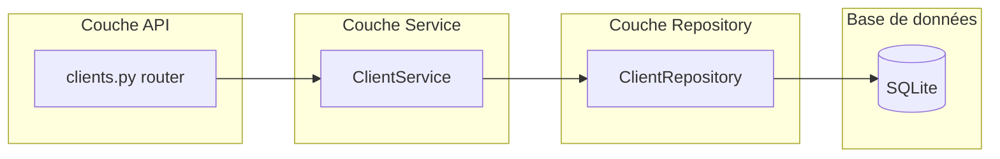
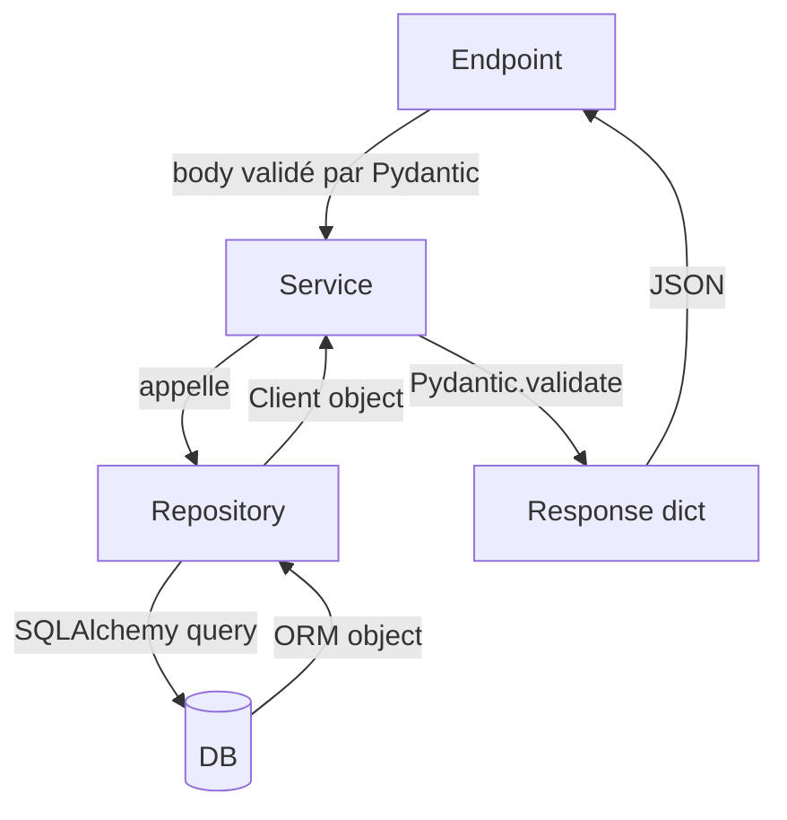

# INT-05 — CRUD Clients API

> **Objectif** : Implémenter le CRUD complet des fiches clients (Create, Read, Update, Delete)
> **Stack** : FastAPI + Repository Pattern + Service Layer + Pydantic

---

## 1. Architecture en couches



**Pourquoi 3 couches ?**

| Couche | Rôle | Ne fait PAS |
|--------|------|-------------|
| **Router** (`api/`) | Valider l'entrée, définir le statut HTTP, documenter | De la logique métier |
| **Service** (`services/`) | Règles métier (404, validation, orchestration) | Des requêtes SQL directement |
| **Repository** (`repositories/`) | Requêtes SQLAlchemy pures | De la logique métier |

---

## 2. Les endpoints

| Méthode | Route | Description | Status |
|---------|-------|-------------|--------|
| `GET` | `/api/v1/clients?page=1&page_size=25&search=dupont` | Liste paginée + recherche | 200 |
| `POST` | `/api/v1/clients` | Création d'un client | **201** |
| `GET` | `/api/v1/clients/{id}` | Détail d'un client | 200 |
| `PUT` | `/api/v1/clients/{id}` | Modification partielle | 200 |
| `DELETE` | `/api/v1/clients/{id}` | Suppression | **204** |

---

## 3. Les DTO Pydantic (schemas/client.py)

### ClientCreate — Validation entrée

```python
class ClientCreate(BaseModel):
    full_name: str = Field(..., min_length=1, max_length=255)  # requis
    phone: str = Field(..., min_length=1, max_length=50)       # requis
    email: str | None = Field(None, max_length=255)            # optionnel
    address: str = Field(..., min_length=1, max_length=500)    # requis
    postal_code: str | None = Field(None, max_length=20)
    city: str | None = Field(None, max_length=255)
    notes: str | None = None
```

**`Field(...)`** signifie "champ obligatoire". FastAPI renverra une erreur 422 automatiquement si le champ est absent.

### ClientUpdate — Mise à jour partielle

```python
class ClientUpdate(BaseModel):
    full_name: str | None = Field(None, ...)  # tous optionnels
    phone: str | None = Field(None, ...)
    address: str | None = Field(None, ...)
    # ...
```

**Tous les champs sont optionnels.** Seuls les champs envoyés sont modifiés (comportement PATCH).

### ClientResponse — Sortie

```python
class ClientResponse(BaseModel):
    id: int
    full_name: str
    phone: str
    email: str | None
    # ...
    model_config = {"from_attributes": True}  # ← convertit l'ORM en dict
```

### ClientListResponse — Pagination

```python
class ClientListResponse(BaseModel):
    items: list[ClientResponse]   # les résultats
    total: int                    # nombre total (sans pagination)
    page: int                     # page courante
    page_size: int                # éléments par page
    pages: int                    # nombre total de pages
```

---

## 4. Repository Pattern (repositories/client.py)

```python
class ClientRepository:
    def __init__(self, db: AsyncSession):
        self.db = db

    async def list(self, page, page_size, search=None) -> list[Client]:
        query = select(Client)
        if search:
            query = query.where(
                or_(
                    Client.full_name.ilike(f"%{search}%"),  # recherche insensible à la casse
                    Client.phone.ilike(f"%{search}%"),
                )
            )
        query = query.order_by(Client.full_name.asc()) \
                     .offset((page - 1) * page_size) \
                     .limit(page_size)
        result = await self.db.execute(query)
        return list(result.scalars().all())
```

**Points clés :**
- `ilike` = LIKE insensible à la casse
- `offset` / `limit` = pagination SQL
- La recherche combine **nom ET téléphone** simultanément en un seul champ `?search=`
- Le repository ne lève **pas** d'exceptions HTTP (c'est le service qui le fait)

---

## 5. Service Layer (services/client.py)

```python
class ClientService:
    def __init__(self, db: AsyncSession):
        self.repo = ClientRepository(db)

    async def get_client(self, client_id: int) -> ClientDetailResponse:
        client = await self._find_or_404(client_id)  # ← 404 si pas trouvé
        return ClientDetailResponse(
            **client.__dict__,
            jobs_count=0,        # sera calculé quand Job existera
            last_job_date=None,
        )

    async def _find_or_404(self, client_id: int):
        client = await self.repo.get_by_id(client_id)
        if client is None:
            raise HTTPException(404, detail="Client non trouvé")
        return client
```

**Responsabilités du service :**
- Convertir les entrées Pydantic en `dict` avec `.model_dump()`
- Valider l'existence (404)
- Filtrer les `None` pour la mise à jour partielle
- Convertir les sorties ORM en Pydantic avec `.model_validate()`

---

## 6. Le router FastAPI

```python
@router.get("", response_model=ClientListResponse)
async def list_clients(
    page: int = 1,                    # ← paramètres de requête
    page_size: int = 25,
    search: str | None = None,
    current_user: User = Depends(get_current_user),  # ← auth requise
    db: AsyncSession = Depends(get_db),
):
    service = ClientService(db)
    return await service.list_clients(page, page_size, search)


@router.post("", response_model=ClientResponse, status_code=201)
async def create_client(
    body: ClientCreate,               # ← validé par Pydantic
    current_user: User = Depends(get_current_user),
    db: AsyncSession = Depends(get_db),
):
    service = ClientService(db)
    return await service.create_client(body)


@router.delete("/{client_id}", status_code=204)
async def delete_client(client_id: int, ...):
    ...
    return Response(status_code=204)  # ← pas de body pour 204
```

**Codes HTTP :**
- `201 Created` pour la création (avec le body du client créé)
- `204 No Content` pour la suppression (pas de body)
- `404 Not Found` pour client inexistant
- `401 Unauthorized` si token manquant

---

## 7. Test des endpoints

```bash
cd backend/
.venv/bin/uvicorn app.main:app --reload

# Créer un client
curl -s -X POST http://localhost:8000/api/v1/clients \
  -H "Authorization: Bearer <token>" \
  -H "Content-Type: application/json" \
  -d '{"full_name": "M. Dupont", "phone": "0612345678", "address": "12 rue de Paris"}'

# Lister avec recherche
curl -s "http://localhost:8000/api/v1/clients?search=dupont&page=1&page_size=10" \
  -H "Authorization: Bearer <token>"

# Détail
curl -s http://localhost:8000/api/v1/clients/1 \
  -H "Authorization: Bearer <token>"

# Mise à jour
curl -s -X PUT http://localhost:8000/api/v1/clients/1 \
  -H "Authorization: Bearer <token>" \
  -H "Content-Type: application/json" \
  -d '{"phone": "0698765432"}'

# Suppression
curl -s -X DELETE http://localhost:8000/api/v1/clients/1 \
  -H "Authorization: Bearer <token>"
# → 204 No Content (pas de body)
```

---

## 8. Résumé : pattern à retenir



Pour chaque nouvelle entité (Job, ChecklistItem, etc.), le pattern est le même :
1. **Schemas** → Pydantic (Create, Update, Response)
2. **Repository** → Requêtes DB
3. **Service** → Logique métier + 404
4. **Router** → Endpoints FastAPI

---

## Tests

INT-05 — CRUD Clients API (5 pts) — ✅ Terminé**

### Tests validés (8/8)

| # | Test | Résultat |
|---|------|----------|
| TC-INT-05-01 | POST /clients — création (201) | ✅ |
| TC-INT-05-02 | GET /clients — liste paginée (200) | ✅ |
| TC-INT-05-03 | GET /clients — recherche par nom | ✅ |
| TC-INT-05-04 | GET /clients — recherche par téléphone | ✅ |
| TC-INT-05-05 | GET /clients/{id} — détail avec jobs_count | ✅ |
| TC-INT-05-06 | GET /clients/{id} — inexistant (404) | ✅ |
| TC-INT-05-07 | PUT /clients/{id} — mise à jour | ✅ |
| TC-INT-05-08 | DELETE /clients/{id} — suppression (204) | ✅ |

### Fichiers créés

| Fichier | Rôle |
|---------|------|
| `app/schemas/client.py` | Schemas Pydantic (Create, Update, Response, List) |
| `app/repositories/client.py` | ClientRepository (CRUD queries) |
| `app/services/client.py` | ClientService (métier + 404) |
| `app/api/v1/clients.py` | Router CRUD (5 endpoints) |
| `notes/INT-05-crud-clients.md` | Note pédagogique |

### Architecture

```
Router (api/v1/clients.py) → Service (services/client.py) → Repository (repositories/client.py) → DB
```
