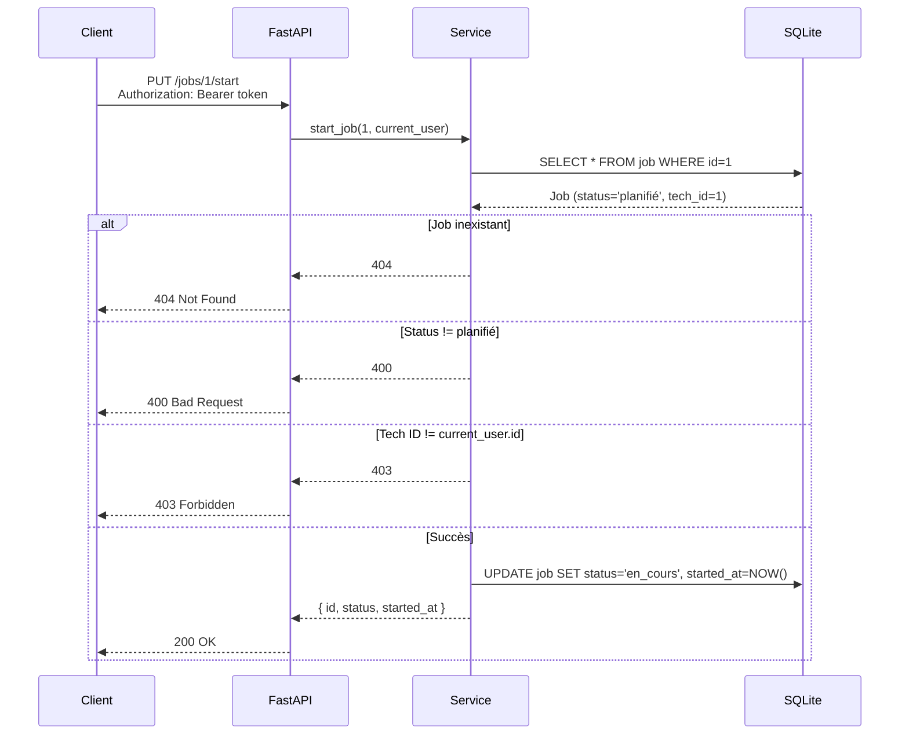

# INT-10 — PUT /jobs/{id}/start (démarrer un job)

> **Objectif** : Permettre au technicien de démarrer un job (→ en_cours + chronomètre)
> **Stack** : FastAPI + SQLAlchemy ORM + workflow validation

---

## 1. L'endpoint

```
PUT /api/v1/jobs/{id}/start
Authorization: Bearer <token>
```

**Réponse 200 :**
```json
{
  "id": 4,
  "status": "en_cours",
  "started_at": "2026-06-06T10:13:16.791160"
}
```

---

## 2. Les validations (3 couches)

```python
async def start_job(self, job_id: int, current_user: User) -> JobStartResponse:
    job = await self._find_or_404(job_id)

    # 1️⃣ Est-ce que le job existe ? → 404
    # (géré par _find_or_404)

    # 2️⃣ Est-ce que le job est planifié ? → 400
    if job.status != JobStatus.PLANIFIE:
        raise HTTPException(400, detail="Le job doit être au statut 'planifié'...")

    # 3️⃣ Est-ce que je suis le bon technicien ? → 403
    if job.technician_id != current_user.id:
        raise HTTPException(403, detail="Vous n'êtes pas assigné à ce job")
```

| Validation | Code HTTP | Message |
|-----------|-----------|---------|
| Job inexistant | 404 | "Job non trouvé" |
| Job déjà en cours/terminé/annulé | 400 | "Le job doit être au statut 'planifié'" |
| Mauvais technicien | 403 | "Vous n'êtes pas assigné à ce job" |
| ✅ Succès | 200 | `{ id, status: "en_cours", started_at }` |

---

## 3. Mise à jour du statut

```python
job.status = JobStatus.EN_COURS
job.started_at = datetime.now(timezone.utc)
await self.repo.db.commit()
await self.repo.db.refresh(job)
```

**Pourquoi `timezone.utc` et pas `datetime.utcnow()` ?**
- `datetime.utcnow()` retourne un objet **naive** (sans fuseau horaire)
- `datetime.now(timezone.utc)` retourne un objet **aware** (avec fuseau)
- SQLAlchemy / Pydantic préfèrent les objets **aware** → stockage + sérialisation corrects

---

## 4. Tests

```bash
# Démarrer un job planifié
curl -s -X PUT http://localhost:8000/api/v1/jobs/1/start \
  -H "Authorization: Bearer <token>"
# → 200 { id: 1, status: "en_cours", started_at: "..." }

# Tentative sur un job déjà en cours
curl -s -X PUT http://localhost:8000/api/v1/jobs/1/start \
  -H "Authorization: Bearer <token>"
# → 400 { detail: "Le job doit être au statut 'planifié'..." }
```

---

## 5. Résumé


