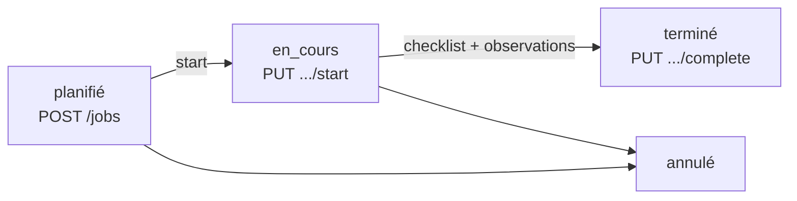

# INT-11 — PUT /jobs/{id}/complete (terminer un job)

> **Objectif** : Permettre au technicien de terminer un job avec validations
> **Stack** : FastAPI + SQLAlchemy ORM + checklist validation

---

## 1. L'endpoint

```
PUT /api/v1/jobs/{id}/complete
Authorization: Bearer <token>
Body: { "observations": "Filtre remplacé. OK." }
```

**Réponse 200 :**

```json
{
  "id": 6,
  "status": "terminé",
  "completed_at": "2026-06-06T11:00:44.001314",
  "duration_minutes": 45
}
```

---

## 2. Les validations

```python
async def complete_job(self, job_id, current_user, body):
    job = await self._find_or_404(job_id)        # → 404

    if job.status != JobStatus.EN_COURS:          # → 400
        raise HTTPException(400, "Le job doit être au statut 'en_cours'...")

    if job.technician_id != current_user.id:      # → 403
        raise HTTPException(403, "Vous n'êtes pas assigné...")

    # Checklist : compter les unchecked
    result = await db.execute(
        select(func.count(ChecklistItem.id)).where(
            ChecklistItem.job_id == job_id,
            ChecklistItem.checked == False
        )
    )
    if result.scalar_one() > 0:                   # → 400
        raise HTTPException(400, f"{n} item(s) non cochés...")

    # (Photos validation — Phase 2)
```

| Validation           | Code | Message                                  |
| -------------------- | ---- | ---------------------------------------- |
| Job inexistant       | 404  | "Job non trouvé"                         |
| Pas en cours         | 400  | "Le job doit être au statut 'en_cours'"  |
| Mauvais technicien   | 403  | "Vous n'êtes pas assigné"                |
| Checklist incomplète | 400  | "5 item(s) non cochés..."                |
| ✅ Succès            | 200  | `{ id, status, completed_at, duration }` |

---

## 3. Calcul de la durée

```python
from datetime import datetime, timezone

job.completed_at = datetime.now(timezone.utc)
duration = int((job.completed_at - job.started_at).total_seconds() // 60)
```

**Conversion :** `timedelta.total_seconds()` → secondes → `/ 60` → minutes entières.

---

## 4. Tests

```bash
# 1. Créer un job, le démarrer
curl -X PUT http://localhost:8000/api/v1/jobs/1/start \
  -H "Authorization: Bearer <token>"

# 2. Cocher tous les items checklist
cd backend/
.venv/bin/python -c "
import asyncio, aiosqlite
async def f():
    db = await aiosqlite.connect('tervo.db')
    await db.execute('UPDATE checklist_item SET checked=1 WHERE job_id=1')
    await db.commit()
    await db.close()
asyncio.run(f())
"

# 3. Terminer le job
curl -s -X PUT http://localhost:8000/api/v1/jobs/1/complete \
  -H "Authorization: Bearer <token>" \
  -H "Content-Type: application/json" \
  -d '{"observations": "Intervention terminée"}'
# → 200 { id, status: "terminé", completed_at, duration_minutes }
```

---

## 5. Résumé du workflow job



Les validations par étape :

- **start** : job doit être `planifié` + technicien assigné
- **complete** : job doit être `en_cours` + technicien assigné + checklist complète

---

## 5. Récapitulatif

6.  INT-11 — PUT /jobs/{id}/complete (5 pts) — ✅ Terminé\*\*

### Tests validés

| #             | Cas                                                          | Résultat     |
| ------------- | ------------------------------------------------------------ | ------------ |
| TC-INT-11-01  | Complete succès (200, `terminé`, `completed_at`, `duration`) | ✅           |
| TC-INT-11-02  | Complete sur job déjà terminé (400)                          | ✅           |
| TC-INT-11-02b | Checklist incomplète → 400 + nombre d'items non cochés       | ✅           |
| TC-INT-11-03  | Photos validation (skip → Phase 2)                           | ⏳ Noté todo |

### Fichiers

| Fichier                                | Action                                              |
| -------------------------------------- | --------------------------------------------------- |
| `app/schemas/job.py`                   | `JobCompleteRequest`, `JobCompleteResponse` ajoutés |
| `app/services/job.py`                  | `complete_job()` avec validations checklist         |
| `app/api/v1/jobs.py`                   | Endpoint `PUT /{id}/complete`                       |
| `docs/tasks.md` (sprint 1.2)           | Flags ✅ (sauf photos → Phase 2)                    |
| `notes/backend/INT-11-complete-job.md` | Note pédagogique                                    |

### Workflow job complet

```
POST /jobs  →  planifié  →  PUT /start  →  en_cours  →  PUT /complete  →  terminé
```

Prêt pour **INT-12 — GET /dashboard/summary** quand tu veux.
