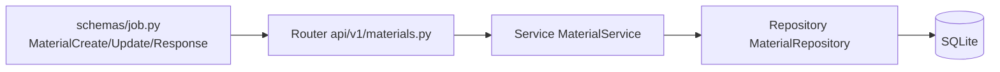

# INT-26 — CRUD Materials API

> **Objectif** : CRUD complet des matériaux utilisés pendant l'intervention
> **Stack** : FastAPI + SQLAlchemy + Repository/Service pattern + schemas Pydantic

---

## 1. Architecture en couches



Même pattern que les autres CRUD (clients, jobs) :

- **Repository** : requêtes SQL pures
- **Service** : logique métier (position auto, 404)
- **Router** : validation entrée + auth + assignation

---

## 2. Les endpoints

| Méthode  | Route                                  | Code HTTP | Description                    |
| -------- | -------------------------------------- | --------- | ------------------------------ |
| `GET`    | `/api/v1/jobs/{job_id}/materials`      | 200       | Liste triée par `position ASC` |
| `POST`   | `/api/v1/jobs/{job_id}/materials`      | **201**   | Ajouter un matériau            |
| `PUT`    | `/api/v1/jobs/{job_id}/materials/{id}` | 200       | Modifier nom/quantité          |
| `DELETE` | `/api/v1/jobs/{job_id}/materials/{id}` | **204**   | Supprimer                      |

**Body POST/PUT :**

```json
{ "name": "Filtre HEPA", "quantity": "1" }
```

---

## 3. MaterialRepository

```python
class MaterialRepository:
    async def list_by_job(self, job_id: int) -> list[Material]:
        result = await self.db.execute(
            select(Material)
            .where(Material.job_id == job_id)
            .order_by(Material.position.asc())  # ← tri obligatoire
        )
        return list(result.scalars().all())

    async def create(self, data: dict) -> Material:
        material = Material(**data)
        self.db.add(material)
        await self.db.commit()
        await self.db.refresh(material)
        return material

    async def update(self, material: Material, data: dict) -> Material:
        for key, value in data.items():
            if value is not None:
                setattr(material, key, value)  # ← mise à jour partielle
        await self.db.commit()
        await self.db.refresh(material)
        return material

    async def delete(self, material: Material) -> None:
        await self.db.delete(material)
        await self.db.commit()
```

**Points à retenir :**

- `.order_by(Material.position.asc())` → l'ordre est géré par la DB, pas par le code
- `setattr()` avec filtre `if value is not None` → mise à jour partielle sans écraser les champs non fournis
- `refresh()` après commit → permet de récupérer les valeurs par défaut de la DB

---

## 4. MaterialService — Position auto

```python
async def create_material(self, job_id: int, data: MaterialCreate) -> MaterialResponse:
    create_data = data.model_dump()
    create_data["job_id"] = job_id

    # Compter les matériaux existants pour la position
    existing = await self.repo.list_by_job(job_id)
    create_data["position"] = len(existing)  # 0, 1, 2...

    material = await self.repo.create(create_data)
    return MaterialResponse.model_validate(material)
```

**Pourquoi `len(existing)` ?** Simple et efficace :

- 1er matériau → position 0
- 2e → position 1
- etc.

### Scénarios concrets

| Action               | `existing` avant  | `len()` | Résultat `position` |
| -------------------- | ----------------- | ------- | ------------------- |
| Ajouter 1er matériau | `[]`              | 0       | `position=0`        |
| Ajouter 2e matériau  | `[Filtre]`        | 1       | `position=1`        |
| Ajouter 3e matériau  | `[Filtre, Joint]` | 2       | `position=2`        |

### Et si on supprime un élément du milieu ?

```python
# Base : [Filtre(pos=0), Joint(pos=1), Silicone(pos=2)] → 3 items
DELETE /materials/2  # supprime Joint (pos=1)
# Résultat : [Filtre(pos=0), Silicone(pos=2)]
#              ↑ trou : pos=1 sautée
```

**Est-ce un problème ?** Non. L'ordre d'affichage est `ORDER BY position ASC` donc Filtre (0) s'affiche avant Silicone (2). Le trou n'est pas gênant — on ne s'occupe pas de combler les trous, ça évite de recalculer toutes les positions à chaque suppression.

### Pourquoi pas un `MAX(position) + 1` ?

```sql
SELECT COALESCE(MAX(position), -1) + 1 FROM material WHERE job_id = ?
```

Plus complexe pour le même résultat : `len(existing)` est plus lisible et la requête `list_by_job` est déjà faite juste après pour afficher la liste.

### Pourquoi pas un auto-increment ?

On ne peut pas car `position` n'est pas une PK — c'est juste un champ d'ordonnancement qui peut être modifié.

### Bilan

`len(existing)` = **0 requête supplémentaire** (on réutilise la liste chargée), **0 ligne de code complexe**, **zéro trou à gérer**.

```python
async def update_material(self, material_id: int, data: dict) -> MaterialResponse:
    material = await self._find_or_404(material_id)
    update_data = {k: v for k, v in data.items() if v is not None}
    material = await self.repo.update(material, update_data)
    return MaterialResponse.model_validate(material)
```

**`model_dump(exclude_unset=True)`** côté router : ne passe que les champs que l'utilisateur a fournis.

✅ Section enrichie.\*\* La note compare maintenant 3 approches :

| Approche            | Nb requêtes      | Complexité | Gère les trous   |
| ------------------- | ---------------- | ---------- | ---------------- |
| `len(existing)`     | 0 (déjà chargée) | 1 ligne    | Pas besoin       |
| `MAX(position) + 1` | 1 requête SQL    | COALESCE   | Oui mais inutile |
| Auto-increment      | 0                | Impossible | —                |

### Avec un scénario concret : suppression du milieu crée un trou (pos 1 sautée), mais `ORDER BY position ASC` gère l'affichage sans souci.

## 5. Router — Vérification d'assignation

```python
@router.post("/{job_id}/materials", response_model=MaterialResponse, status_code=201)
async def create_material(job_id, body, current_user, db):
    job = await _get_job_or_404(db, job_id)           # → 404 si job inexistant
    _check_assignation(job, current_user)              # → 403 si pas le bon tech
    service = MaterialService(db)
    return await service.create_material(job_id, body)
```

**`_check_assignation`** réutilisée (identique à celle de `checklist.py` et `photos.py`) :

```python
def _check_assignation(job: Job, current_user: User) -> None:
    if job.technician_id != current_user.id:
        raise HTTPException(403, detail="Vous n'êtes pas assigné à ce job")
```

---

## 6. Schémas Pydantic

```python
class MaterialCreate(BaseModel):
    name: str = Field(..., min_length=1, max_length=255)
    quantity: str | None = Field(None, max_length=50)

class MaterialUpdate(BaseModel):
    name: str | None = Field(None, min_length=1, max_length=255)
    quantity: str | None = Field(None, max_length=50)

class MaterialResponse(BaseModel):
    id: int
    job_id: int
    name: str
    quantity: str | None = None
    position: int
    model_config = {"from_attributes": True}  # ← convertit ORM → dict
```

**Différence Create vs Update :**

- `Create` : `name` est obligatoire (`Field(...)`)
- `Update` : tout est optionnel (`Field(None)`) → PATCH-like

---

## 7. Fichiers créés

| Fichier                        | Rôle                                            |
| ------------------------------ | ----------------------------------------------- |
| `app/repositories/material.py` | Requêtes DB (list, get, create, update, delete) |
| `app/services/material.py`     | Logique métier + position auto + 404            |
| `app/api/v1/materials.py`      | 4 endpoints + assignation                       |
| `app/schemas/job.py`           | 3 schémas (Create, Update, Response)            |
| `app/main.py`                  | `materials_router` enregistré                   |
