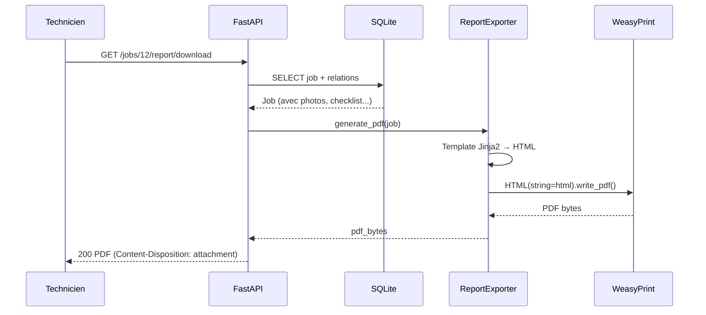

# INT-30 — GET /jobs/{id}/report/download

> **Objectif** : Endpoint de téléchargement du rapport PDF d'une intervention terminée
> **Stack** : FastAPI + WeasyPrint + Jinja2

---

## 1. L'endpoint

```
GET /api/v1/jobs/{job_id}/report/download
Authorization: Bearer <token>
```

### Réponses

| Status | Condition | Body |
|---|---|---|
| **200** | Job terminé + technicien assigné | PDF bytes (`application/pdf`) |
| **400** | Job pas encore terminé | `{"detail": "Le job doit être terminé..."}` |
| **403** | Technicien non assigné à ce job | `{"detail": "Vous n'êtes pas assigné..."}` |
| **404** | job_id inexistant | `{"detail": "Job non trouvé"}` |

### Headers de la réponse 200

```
Content-Type: application/pdf
Content-Disposition: attachment; filename="rapport-intervention-{id}.pdf"
```

---

## 2. Le router — `reports.py`

```python
@router.get("/{job_id}/report/download")
async def download_report(
    job_id: int,
    current_user: User = Depends(get_current_user),
    db: AsyncSession = Depends(get_db),
):
    repo = JobRepository(db)
    job = await repo.get_by_id(job_id)
    # job a déjà toutes les relations chargées
```

### 2.1 Pourquoi `JobRepository.get_by_id()` et pas une simple query ?

```python
# ❌ Ceci ne fonctionnerait PAS :
job = await db.execute(select(Job).where(Job.id == job_id))
# → job.client, job.photos, job.materials seraient LAZY LOADED
# → AttributeError ou N+1 queries
```

`ReportExporter.generate_pdf()` a besoin de **toutes** les relations du job :

| Relation | Usage dans le PDF |
|---|---|
| `job.client` | Nom, adresse, téléphone |
| `job.technician` | Nom du technicien |
| `job.checklist_items` | Items pré/post avec état |
| `job.photos` | Embed en base64 |
| `job.materials` | Liste des matériaux |

`JobRepository.get_by_id()` utilise `selectinload()` pour précharger toutes ces relations en **une seule requête SQL** (avec des JOINs ou sous-requêtes). Sans ça, SQLAlchemy ferait une requête par relation accédée (N+1 problem).

### 2.2 Les validations

```python
# 1. Job existe ?
if job is None:
    raise HTTPException(status_code=404, detail="Job non trouvé")

# 2. Technicien assigné ?
if job.technician_id != current_user.id:
    raise HTTPException(status_code=403, detail="Vous n'êtes pas assigné...")

# 3. Job terminé ?
if job.status != "terminé":
    raise HTTPException(status_code=400, detail="Le job doit être terminé...")
```

L'ordre des validations est important :
- **404 d'abord** : pas besoin de vérifier l'assignation si le job n'existe pas
- **403 ensuite** : on vérifie les droits avant de générer le PDF (coûteux)
- **400 en dernier** : le statut est une validation métier, pas une erreur d'auth

### 2.3 Génération du PDF

```python
exporter = ReportExporter()         # charge le template Jinja2
pdf_bytes = exporter.generate_pdf(job)  # rend + convertit
```

`ReportExporter` est instancié à chaque requête car il charge le template depuis le disque. La génération prend ~1-2 secondes selon la taille du job (nombre de photos à encoder en base64).

### 2.4 La réponse HTTP

```python
return Response(
    content=pdf_bytes,
    media_type="application/pdf",
    headers={
        "Content-Disposition": f'attachment; filename="rapport-intervention-{job_id}.pdf"',
    },
)
```

**Pourquoi `Response` et pas `StreamingResponse` ?**
- Le PDF fait ~15 Ko (quelques centaines de Ko avec photos)
- Il tient en mémoire sans problème
- `StreamingResponse` est utile pour des fichiers > 100 Mo (streaming par chunks)

**Pourquoi `attachment` et pas `inline` ?**
- `attachment` → le navigateur **télécharge** le fichier
- `inline` → le navigateur **affiche** le PDF dans la fenêtre
- Le choix est fait dans le frontend (INT-35), ici on force le download

---

## 3. Enregistrement dans `main.py`

```python
from app.api.v1.reports import router as reports_router

app.include_router(reports_router, prefix=settings.API_V1_PREFIX)
```

Le préfixe `/api/v1` est appliqué à toutes les routes du router, donc `GET /jobs/{id}/report/download` devient `GET /api/v1/jobs/{id}/report/download`.

---

## 4. Fichiers

| Fichier | Action |
|---|---|
| `app/api/v1/reports.py` | **Nouveau** — endpoint download |
| `app/main.py` | `reports_router` enregistré |

---

## 5. Tests validés

### TC-INT-30-01 : Job terminé → PDF

```bash
curl -s -D - "http://localhost:8000/api/v1/jobs/12/report/download" \
  -H "Authorization: Bearer $TOKEN" -o /tmp/rapport-12.pdf
```

| Critère | Attendu | Résultat |
|---|---|---|
| status_code | 200 | ✅ 200 OK |
| content_type | application/pdf | ✅ |
| content_disposition | `attachment; filename="rapport-intervention-12.pdf"` | ✅ |
| body | non vide | ✅ 13 219 bytes |

### TC-INT-30-02 : Job non terminé → 400

```bash
curl -s "http://localhost:8000/api/v1/jobs/13/report/download" \
  -H "Authorization: Bearer $TOKEN"
# → {"detail": "Le job doit être terminé pour générer le rapport."}
```

---

## 6. Dépendances

```
INT-29 (ReportExporter + Template) ← socle technique
    ↓
INT-30 (Endpoint download)         ← utilise ReportExporter
    ↓
INT-34 (Auto share_token)          → ajoute report_url dans JobCompleteResponse
    ↓
INT-35 (Frontend Rapport)          → affiche le PDF dans un iframe
```

---

## 7. Mermaid


