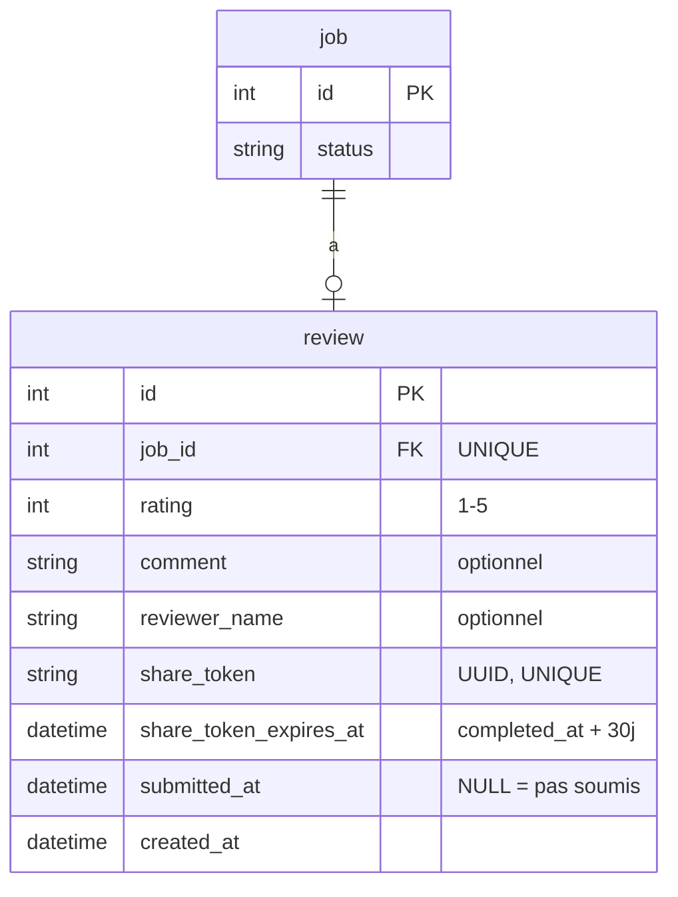

# INT-31 — Modèle `Review` + migration

> **Objectif** : Créer le modèle SQLAlchemy `Review` pour recueillir les avis clients sur les interventions terminées
> **Stack** : SQLAlchemy ORM + Alembic

---

## 1. Contexte

Chaque intervention terminée doit pouvoir être notée par le client via un lien public sécurisé. Le modèle `Review` stocke :

- La note (1-5)
- Un commentaire optionnel
- Un token unique (share_token) pour sécuriser le lien public
- Une date d'expiration du lien (30 jours après complétion du job)
- Un flag `submitted_at` pour savoir si l'avis a déjà été soumis

---

## 2. Le modèle — `models/review.py`

```python
class Review(Base):
    __tablename__ = "review"

    id = Column(Integer, primary_key=True, index=True)
    # ...
```

### 2.1 Les colonnes en détail

```python
job_id = Column(
    Integer,
    ForeignKey("job.id", ondelete="CASCADE"),
    nullable=False,
    unique=True,   # ← UNIQUE : un seul avis par job
    index=True,
)
```

**Pourquoi `unique=True` ?**
- Un client ne peut donner qu'un seul avis par intervention
- La contrainte UNIQUE en base empêche les doublons au niveau DB
- C'est une sécurité supplémentaire : même si le code laisse passer, la DB refuse

```python
rating = Column(Integer, nullable=False)  # 1-5
```

- Stocké en INTEGER simple (pas de CHECK contrainte en SQLite)
- La validation `1 <= rating <= 5` est faite **côté application** dans INT-33
- Pourquoi pas en DB ? Les CHECK constraints SQLite ne sont pas bien supportées par tous les ORMs. La validation Pydantic est plus fiable et portable.

```python
comment = Column(Text, nullable=True)
reviewer_name = Column(String(255), nullable=True)
```

- `comment` : texte long (avis détaillé)
- `reviewer_name` : nom du client (optionnel — le client peut rester anonyme)

```python
share_token = Column(
    String(64), unique=True, nullable=False, index=True
)
```

**Pourquoi VARCHAR(64) et pas UUID ?**
- Le `share_token` est une chaîne hexadécimale de 32 caractères (`uuid.uuid4().hex`)
- VARCHAR(64) laisse la place pour des tokens plus longs si besoin (`secrets.token_urlsafe(32)` fait ~43 chars)
- `unique=True` + `index=True` : la recherche par token est rapide (INDEX), et deux tokens identiques sont impossibles (UNIQUE)

```python
share_token_expires_at = Column(DateTime, nullable=False)
```

- Date d'expiration du lien = `completed_at + 30 jours`
- La valeur est fixée dans **INT-34** (création automatique à la complétion du job)
- `nullable=False` : un token doit toujours avoir une expiration

```python
submitted_at = Column(DateTime, nullable=True)  # NULL = pas encore soumis
```

- **NULL** = l'avis n'a pas encore été soumis
- **Datetime** = l'avis a été soumis à cette date
- Permet de différencier "avis pas encore donné" vs "avis déjà soumis" sans colonne booléenne supplémentaire

```python
created_at = Column(DateTime, server_default=func.now(), nullable=False)
```

- Rempli automatiquement par la DB à l'insertion

### 2.2 La relation

```python
job = relationship("Job", back_populates="review")
```

Côté `Job` (dans `models/job.py`) :

```python
review = relationship(
    "Review", back_populates="job",
    uselist=False,                  # ← OneToOne, pas une liste
    cascade="all, delete-orphan"
)
```

**`uselist=False`** : indique à SQLAlchemy que `job.review` est un objet unique (`Review | None`), pas une liste (`list[Review]`). Sans ça, SQLAlchemy créerait une relation OneToMany et `job.review` retournerait une liste.

**`cascade="all, delete-orphan"`** : si le job est supprimé, la review associée est automatiquement supprimée.

---

## 3. La migration

### 3.1 Génération

```bash
cd backend/
.venv/bin/alembic revision --autogenerate -m "add review table"
```

### 3.2 Piège évité : SQLite + ALTER TABLE DROP CONSTRAINT

```diff
- op.drop_constraint(None, 'job', type_='foreignkey')    # ← À SUPPRIMER
- op.create_foreign_key(None, 'job', 'client', ...)      # ← À SUPPRIMER
  op.create_table('review', ...)
```

**Problème :** Alembic a détecté une différence de nommage dans les foreign keys de la table `job` (client_id, technician_id). Il a généré des `ALTER TABLE ... DROP CONSTRAINT` puis `ALTER TABLE ... ADD CONSTRAINT` pour renommer les contraintes.

**SQLite ne supporte pas `ALTER TABLE ... DROP CONSTRAINT`**. La seule façon de modifier des contraintes en SQLite est de recréer la table complète (batch mode), ce qu'Alembic peut faire avec `with op.batch_alter_table('job')`.

**Solution :** Éditer manuellement le fichier de migration pour supprimer les opérations `drop_constraint` et `create_foreign_key` sur la table `job`. Ne garder que `create_table('review')`.

```python
def upgrade() -> None:
    op.create_table('review', ...)     # ← OK
    op.create_index(...)                # ← OK
    # op.drop_constraint(...)          # ← SUPPRIMÉ (SQLite reject)
    # op.create_foreign_key(...)       # ← SUPPRIMÉ
```

### 3.3 Application

```bash
# Si la table existe déjà (créée par le premier run avant correction)
.venv/bin/alembic stamp add2e3d9afdc

# Sinon
.venv/bin/alembic upgrade head
```

---

## 4. Vérification

```bash
.venv/bin/python -c "
from app.models.review import Review
from app.models.job import Job

# Vérifier les colonnes
for col in Review.__table__.columns:
    print(f'{col.name:25s} {str(col.type):20s} nullable={col.nullable}')

print()

# Vérifier la relation
print('Job.review:', Job.review)
# → InstrumentedAttribute(Review.job, Review.id)
# (pas une liste, bien un OneToOne)
"
```

---

## 5. Fichiers modifiés

| Fichier | Action | Détail |
|---|---|---|
| `app/models/review.py` | **Nouveau** | Modèle Review complet |
| `app/models/job.py` | Modifié | `review = relationship(uselist=False)` ajouté |
| `app/models/__init__.py` | Modifié | `from app.models.review import Review` |
| `alembic/versions/add2e3d9afdc_add_review_table.py` | **Nouveau** | Migration (éditée manuellement) |

---

## 6. Tests validés (TC-INT-31-01)

| Critère | Attendu | Résultat |
|---|---|---|
| `table_exists` | true | ✅ `SELECT * FROM review` OK |
| `columns` | 9 colonnes | ✅ id, job_id, rating, comment, reviewer_name, share_token, share_token_expires_at, submitted_at, created_at |
| `job_id_unique` | true | ✅ `UNIQUE` sur job_id |
| `share_token_unique` | true | ✅ `UNIQUE` + `INDEX` sur share_token |
| `rating_check` | 1-5 | ✅ Validation côté application (INT-33) |

---

## 7. Dépendances

```
INT-31 (Modèle Review) ← socle
    ↓
INT-32 (GET /review/{token}) → endpoint public
INT-33 (POST /review/{token}/submit) → soumission avis
    ↓
INT-34 (Auto share_token dans complete_job) → utilise le modèle
    ↓
INT-36 (Frontend ReviewPage) → interface client
```

INT-31 débloque **TD-B003** (relation `job.review` — maintenant complète avec photos + materials + review) et **TD-B006** (Review client — modèle créé, endpoints restants).

---

## 8. Mermaid


