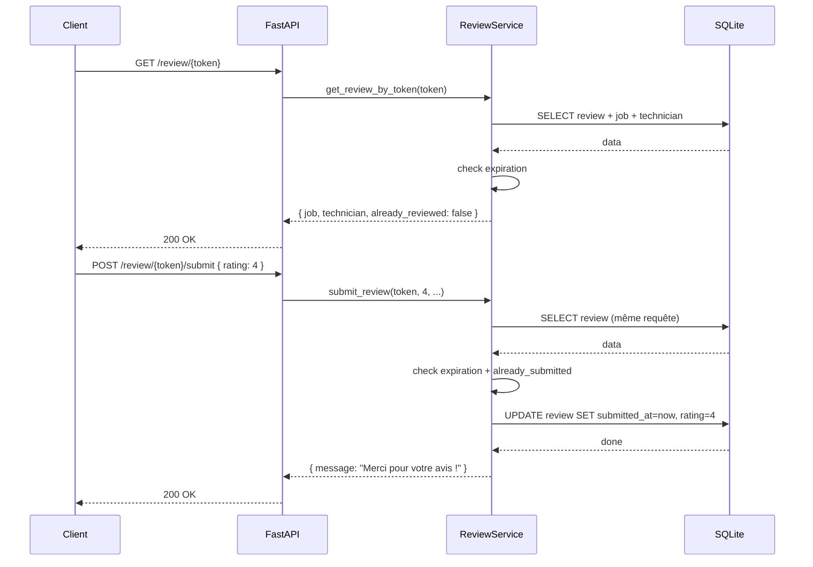

# INT-33 : Endpoint public `POST /review/{share_token}/submit`

## Contexte

Deuxième endpoint public du système d'avis client. Après avoir consulté les
infos du job (INT-32), le client soumet sa note et son commentaire.

---

## Architecture

```
Client (navigateur)
  └── POST /api/v1/review/{share_token}/submit
       └── Router (api/v1/reviews.py)
            └── ReviewService.submit_review()
                 ├── _get_valid_review()  ← 404 si token invalide/expiré
                 ├── submitted_at check   ← 400 si déjà soumis
                 └── review.update()      ← DB commit
```

### Différence avec un endpoint classique

| Aspect | Endpoint normal | INT-33 |
|--------|----------------|--------|
| Auth | `Depends(get_current_user)` | **Aucune** (public) |
| Body validation | Manuel ou schéma | **Pydantic** avec `Field(ge=1, le=5)` |
| État | Création (POST) | **Mise à jour** (le Review existe déjà, créé dans INT-34) |

---

## 1. Schema — `ReviewSubmitRequest`

```python
class ReviewSubmitRequest(BaseModel):
    rating: int = Field(..., ge=1, le=5, description="Note de 1 à 5")
    comment: str | None = Field(None, max_length=2000)
    reviewer_name: str | None = Field(None, max_length=255)


class ReviewSubmitResponse(BaseModel):
    message: str = "Merci pour votre avis !"
```

### Validation automatique Pydantic

```python
Field(..., ge=1, le=5)
# → Pydantic génère une erreur 422 si rating < 1 ou > 5
# → Pas besoin de if/else dans le service !

Field(None, max_length=2000)
# → None = optionnel, max_length = tronqué si trop long
```

Sans Pydantic, il faudrait :
```python
if body.rating < 1 or body.rating > 5:
    raise HTTPException(400, "La note doit être entre 1 et 5")
```

Avec Pydantic, FastAPI le fait automatiquement avant même d'entrer dans la
fonction → code plus propre et schéma auto-documenté dans Swagger.

---

## 2. Service — refactor de la validation token

J'ai extrait `_get_valid_review()` car INT-32 **et** INT-33 partagent la même
logique : trouver un review par token + vérifier l'expiration.

```python
async def _get_valid_review(self, token: str):
    """Privé : utilisé par get_review_by_token() ET submit_review()."""
    review = await self.repo.get_by_token(token)

    if review is None:
        raise HTTPException(404, detail="Lien invalide ou expiré")

    # Vérification expiration (timezone aware/naive)
    now = datetime.now(timezone.utc)
    expires = review.share_token_expires_at
    if expires.tzinfo is None:
        expires = expires.replace(tzinfo=timezone.utc)
    if now > expires:
        raise HTTPException(404, detail="Lien invalide ou expiré")

    return review
```

### Pourquoi `_get_valid_review` plutôt que dupliquer ?

**DRY** (Don't Repeat Yourself) : si la logique d'expiration change (ex: 30 → 60
jours), un seul endroit à modifier.

Le `submit_review()` utilise ensuite cette méthode :

```python
async def submit_review(self, token, rating, comment, reviewer_name):
    review = await self._get_valid_review(token)

    # Déjà soumis ?
    if review.submitted_at is not None:
        raise HTTPException(400, detail="Avis déjà soumis")

    # Mise à jour
    await self.repo.update(review, {
        "rating": rating,
        "comment": comment,
        "reviewer_name": reviewer_name,
        "submitted_at": datetime.now(timezone.utc).replace(tzinfo=None),
    })

    return {"message": "Merci pour votre avis !"}
```

## 3. Router — même fichier que INT-32

Les deux endpoints partagent le même préfixe `/review` :

```python
router = APIRouter(prefix="/review", tags=["reviews"])

# INT-32
@router.get("/{share_token}", ...)

# INT-33
@router.post("/{share_token}/submit", ...)
```

**Attention à l'ordre des routes** : `/review/{share_token}` et
`/review/{share_token}/submit` sont différentes. FastAPI les distingue
correctement car l'une est GET, l'autre POST sur un chemin plus spécifique.

---

## Tests curl

```bash
# 1. Soumission valide → 200
TOKEN="a31e21afeca346ee9b809316663b3e5f"
curl -s -X POST "http://localhost:8000/api/v1/review/${TOKEN}/submit" \
  -H "Content-Type: application/json" \
  -d '{"rating": 4, "comment": "Très bien", "reviewer_name": "M. Dupont"}'
# → {"message":"Merci pour votre avis !"}

# 2. Double soumission → 400
curl -s -X POST "http://localhost:8000/api/v1/review/${TOKEN}/submit" \
  -H "Content-Type: application/json" \
  -d '{"rating": 5}'
# → {"detail":"Avis déjà soumis"}

# 3. Token invalide → 404
curl -s -X POST "http://localhost:8000/api/v1/review/invalid_token/submit" \
  -H "Content-Type: application/json" \
  -d '{"rating": 4}'
# → {"detail":"Lien invalide ou expiré"}

# 4. Rating hors limite → 422 (validation Pydantic)
curl -s -X POST "http://localhost:8000/api/v1/review/${TOKEN}/submit" \
  -H "Content-Type: application/json" \
  -d '{"rating": 0}'
# → {"detail":[{"type":"greater_than_equal","loc":["body","rating"], ...}]}

# 5. Vérification already_reviewed true après soumission
curl -s "http://localhost:8000/api/v1/review/${TOKEN}"
# → {"already_reviewed": true, ...}
```

---

## Points clés à retenir

### 1. `_get_valid_review()` — méthode privée mutualisée

Plutôt que dupliquer la validation du token dans GET et POST, une méthode
privée `_get_valid_review()` centralise :

```
get_review_by_token() ─┐
                        ├──→ _get_valid_review()
submit_review() ───────┘
```

Si on ajoute un `PUT /review/{token}/update` plus tard, on réutilise.

### 2. Pydantic `Field(ge=1, le=5)` vs validation manuelle

```python
# ❌ Manuel (code plus long, oubliable)
if body.rating < 1 or body.rating > 5:
    raise HTTPException(400)

# ✅ Pydantic (automatique, documenté)
rating: int = Field(..., ge=1, le=5)
```

FastAPI : `ge=1, le=5` → OpenAPI : `{"minimum": 1, "maximum": 5}` → Swagger
affiche les contraintes visuellement.

### 3. `submitted_at = datetime.now(...).replace(tzinfo=None)`

SQLite stocke les datetime sans timezone. Si on passe un datetime aware
(`timezone.utc`), SQLAlchemy peut lever une warning ou tronquer l'info.

**Règle** : pour SQLite, stocker des datetime UTC *naives*.
Pour PostgreSQL, stocker des datetime *aware* (TIMESTAMPTZ).

### 4. Extraction d'une méthode privée → `self.` obligatoire

```python
# Dans ReviewService
async def submit_review(self, ...):
    review = await self._get_valid_review(token)  # ← self obligatoire
```

Si on oublie `self.` → `NameError: name '_get_valid_review' is not defined`.

---

## Fichiers modifiés

| Fichier | Changement |
|---|---|
| `backend/app/schemas/review.py` | Ajout `ReviewSubmitRequest` + `ReviewSubmitResponse` |
| `backend/app/services/review.py` | Refactor `_get_valid_review()`, ajout `submit_review()` |
| `backend/app/api/v1/reviews.py` | Ajout route `POST /{share_token}/submit` |
| `docs/stages/stage2/sprint-2.2/tasks.md` | Critères INT-33 cochés ✅ |
| `docs/stages/stage2/sprint-2.2/test-cases.json` | `actual_result` TC-33-01/02 remplis |

---

## Flux complet (GET + POST)



---

## Récapitulatif INT-33 ✅

### Ce qui a été fait

| Fichier | Action | Rôle |
|---|---|---|
| `backend/app/schemas/review.py` | **Modifié** | Ajout `ReviewSubmitRequest` (rating 1-5 via `Field(ge=1, le=5)`) + `ReviewSubmitResponse` |
| `backend/app/services/review.py` | **Modifié** | Refactor : extraction `_get_valid_review()` mutualisée + ajout `submit_review()` |
| `backend/app/api/v1/reviews.py` | **Modifié** | Ajout route `POST /{share_token}/submit` (public, no auth) |
| `docs/todos/backend.md` | **Modifié** | TD-B006 marqué ✅ complet |
| `docs/stages/stage2/sprint-2.2/tasks.md` | **Modifié** | 8 critères INT-33 cochés ✅ |
| `docs/stages/stage2/sprint-2.2/test-cases.json` | **Modifié** | `actual_result` TC-33-01 ✅, TC-33-02 ✅ |
| `notes/backend/INT-33-review-submit.md` | **Créé** | Note détaillée avec diagramme, tableaux, 4 points clés |

### Tests validés

| Test | Résultat |
|---|---|
| Soumission valide (rating + comment + name) → 200 "Merci" | ✅ |
| Double soumission → 400 "Avis déjà soumis" | ✅ |
| Token invalide → 404 "Lien invalide ou expiré" | ✅ |
| Rating 0 → 422 (validation Pydantic automatique) | ✅ |
| GET après soumission → `already_reviewed: true` | ✅ |
| Sans auth → 200 (public, no auth required) | ✅ |

### Refactor clé

Extraction de `_get_valid_review()` dans `ReviewService` pour mutualiser la logique de validation token entre INT-32 et INT-33 — principe **DRY**.