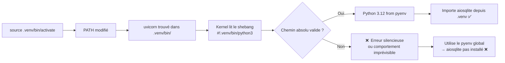

# Renommer un dossier projet cassé son venv — les cas `siteflow` → `resQ` → `Tervo`

## Le constat (×2)

Ce problème est arrivé **deux fois** sur ce projet :

- `siteflow` → `resQ` (1er rename)
- `resQ` → `Tervo` (2e rename)

Dans les deux cas, le symptôme est le même :

Après avoir renommé le dossier, la commande habituelle ne fonctionne plus :

```bash
cd backend/
source .venv/bin/activate
uvicorn main:app --reload
# ❌ ModuleNotFoundError: No module named 'aiosqlite'
```

Pourtant, le fichier `aiosqlite` est bien installé (visible avec `pip list`).

---

## 1. Structure d'un environnement virtuel

Un venv contient entre autres :

```
.venv/
├── bin/
│   ├── activate          ← script à sourcer
│   ├── python            ← symlink → python3
│   ├── python3           ← symlink → /home/.../.pyenv/versions/3.12.0/bin/python3
│   ├── uvicorn           ← script exécutable
│   ├── pip               ← script exécutable
│   └── ...               ← tous les binaires des paquets installés
├── lib/
│   └── python3.12/
│       └── site-packages/
│           ├── aiosqlite/   ← paquets installés
│           └── ...
└── pyvenv.cfg
```

Quand on `source .venv/bin/activate` :

1. `PATH` est modifié pour que `.venv/bin/` passe en premier
2. `VIRTUAL_ENV` est positionné
3. Le `PATH` devient : `.venv/bin:$PATH`

## 2. Le problème : le shebang

Chaque script dans `.venv/bin/` commence par un **shebang** (`#!`) qui pointe vers l'interpréteur Python. Ce chemin est **écrit en dur** à la création du venv.

```bash
head -1 .venv/bin/uvicorn
# → #!/home/lob/workspace/python/fastapi/siteflow/backend/.venv/bin/python3
#                                              ^^^^^^^^
```

Quand on a renommé `siteflow` → `resQ`, ce chemin est devenu **invalide** :

```
/home/lob/workspace/python/fastapi/siteflow/backend/.venv/bin/python3
                                        ✗  ce dossier n'existe plus
```

### Pourquoi la commande `.venv/bin/python -m uvicorn` marche mais pas `uvicorn` ?

- **`.venv/bin/python -m uvicorn`** → tu appelles directement l'interpréteur Python via son **symlink**, qui lui est valide (il pointe vers une version pyenv existante)
- **`uvicorn`** (après activation) → le shell exécute `.venv/bin/uvicorn` → lit le **shebang** → ce chemin n'existe plus → le script ne peut pas démarrer correctement



### Pourquoi ça marchait AVANT le rename ?

Parce que le dossier s'appelait encore `siteflow` → le chemin absolu dans le shebang correspondait à un dossier réel sur le disque.

## 3. Le piège pyenv

Sur cette machine, pyenv ajoute ses **shims** dans le PATH :

```
~/.pyenv/shims:/home/lob/.local/bin:/usr/bin:...
```

Les shims pyenv sont des **intercepteurs** : quand tu tapes `python` ou `uvicorn`, pyenv redirige vers sa propre version de Python (3.12.0 globale), PAS celle du venv.

Même avec le venv activé, si le shebang cassé fait échouer le script `.venv/bin/uvicorn`, pyenv prend le relais et lance le `uvicorn` global — qui n'a pas `aiosqlite`.

```bash
which uvicorn
# → /home/lob/.pyenv/shims/uvicorn    ← pas celui du venv !
```

## 4. La solution

### A — Recréer le venv (recommandé)

```bash
cd backend/
rm -rf .venv
uv venv                  # utilise pyenv 3.12.0, ultra-rapide
uv sync                  # installe depuis pyproject.toml + génère uv.lock
```

Les nouveaux shebabs pointeront vers le bon chemin :

```bash
head -1 .venv/bin/uvicorn
# → #!/home/lob/workspace/python/fastapi/Tervo/backend/.venv/bin/python3
#                                              ^^^
```

### B — Solution de contournement (sans recréer)

Utiliser `uv run` qui utilise automatiquement le venv :

```bash
cd backend/
uv run uvicorn main:app --reload
```

Ou explicitement via le Python du venv :

```bash
cd backend/
.venv/bin/python -m uvicorn main:app --reload
```

## 5. Vérifier l'état du venv

```bash
# Vérifier le shebang d'un binaire
head -1 .venv/bin/uvicorn

# Vérifier le symlink python
ls -la .venv/bin/python3
# → python3 -> /home/lob/.pyenv/versions/3.12.0/bin/python3  ← doit exister

# Vérifier que la DB existe au bon endroit
ls -la *.db
# → tervo.db  (et PAS siteflow.db)

# Vérifier que les dépendances sont installées
uv pip list | grep aiosqlite
# → aiosqlite 0.22.1
```

## 6. Leçon à retenir

**Renommer un dossier projet = toujours recréer le venv.**

Les chemins absolus dans les shebangs des binaires du venv ne sont pas mis à jour automatiquement. C'est une limitation de `venv` (et de `virtualenv`). Le symlink `python3` reste valide car il pointe vers un chemin pyenv qui, lui, ne change pas — mais les scripts exécutables (`uvicorn`, `pip`, `pytest`, etc.) ont le chemin du projet écrit en dur.

| Élément              | Chemin absolu ?                    | Cassé par rename ? |
| -------------------- | ---------------------------------- | ------------------ |
| Shebang de `uvicorn` | Oui → `siteflow/...`               | ❌ Oui             |
| Symlink `python3`    | Oui → `.pyenv/versions/3.12.0/...` | ✅ Non             |
| Fichier DB           | `sqlite:///./tervo.db` (relatif)   | ✅ Non (relatif)   |
| `activate`           | Non (utilise `DIR`/`VIRTUAL_ENV`)  | ✅ Non             |
| Paquets `.venv/lib/` | Non (import Python)                | ✅ Non             |

---

_Note mise à jour après les deux renames SiteFlow → ResQ → Tervo — Juillet 2026_
