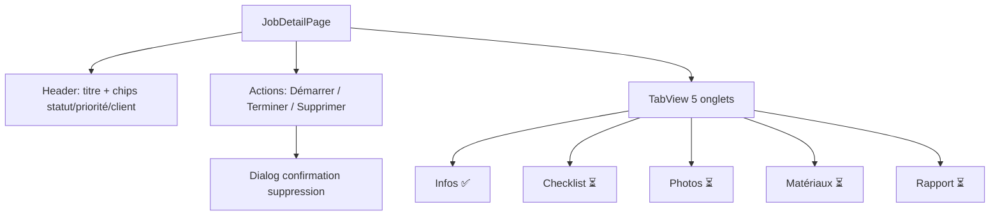

# INT-15 — Frontend JobDetailPage (fiche avec onglets)

> **Objectif** : Afficher le détail complet d'un job avec onglets et actions
> **Stack** : Vue 3 + PrimeVue TabView + Dialog + Query invalidation

---

## 1. Structure de la page



---

## 2. Route

```ts
{
  path: '/jobs/:id',
  name: 'JobDetail',
  component: () => import('@/pages/JobDetailPage.vue'),
  meta: { requiresAuth: true, title: 'Intervention' },
}
```

**Ordre important :** la route `/jobs/:id` doit être placée **après** `/jobs` dans le tableau.

---

## 3. Onglets TabView

```vue
<TabView>
  <TabPanel header="Infos">
    <!-- Champs : client, adresse, technicien, dates, description, observations -->
  </TabPanel>

  <TabPanel header="Checklist" :disabled="true">
    <p>Disponible dans une prochaine version</p>
  </TabPanel>

  <TabPanel header="Photos" :disabled="true">...</TabPanel>
  <TabPanel header="Matériaux" :disabled="true">...</TabPanel>
  <TabPanel header="Rapport" :disabled="true">...</TabPanel>
</TabView>
```

**`disabled`** : grise l'onglet et empêche le clic — parfait pour les fonctionnalités à venir.

---

## 4. Actions

```vue
<!-- Job planifié → bouton Démarrer -->
<Button
  v-if="job.status === 'planifié'"
  label="▶ Démarrer"
  severity="success"
  :loading="actionLoading"
  @click="handleStart"
/>

<!-- Job en cours → bouton Terminer (disabled pour l'instant) -->
<Button v-if="job.status === 'en_cours'" label="Terminer" severity="danger" disabled />

<!-- Job planifié ou annulé → bouton Supprimer -->
<Button
  v-if="job.status === 'planifié' || job.status === 'annulé'"
  label="Supprimer"
  severity="secondary"
  @click="showDeleteDialog = true"
/>
```

---

## 5. Invalidation du cache après mutation

```ts
async function handleStart() {
  await api.put(`/jobs/${jobId}/start`, {}, auth.token);
  // ❌ NE PAS faire refetch() — on invalide le cache
  queryClient.invalidateQueries({ queryKey: ["job", jobId] });
  queryClient.invalidateQueries({ queryKey: ["jobs"] });
  queryClient.invalidateQueries({ queryKey: ["dashboard"] });
}
```

**Pourquoi `invalidateQueries` plutôt que `refetch()` ?**

- `invalidateQueries` marque le cache comme périmé
- Vue Query le re-fetch automatiquement au prochain montage
- Ça évite les appels redondants si plusieurs composants utilisent la même queryKey

---

## 6. Dialog de confirmation

```vue
<Dialog v-model:visible="showDeleteDialog" header="Confirmer la suppression" modal>
  <p>Supprimer cette intervention ? Cette action est irréversible.</p>
  <Button label="Annuler" severity="secondary" @click="showDeleteDialog = false" />
  <Button label="Confirmer" severity="danger" @click="handleDelete" />
</Dialog>
```

---

## 7. Fichiers

| Fichier                       | Action                                                              |
| ----------------------------- | ------------------------------------------------------------------- |
| `src/api/client.ts`           | Types `ChecklistItemRef`, `JobDetailResponse` + `jobsApi.getById()` |
| `src/pages/JobDetailPage.vue` | **Nouveau** — TabView + actions + Dialog                            |
| `src/router/index.ts`         | Route `/jobs/:id` ajoutée                                           |

---

# 8. Récap

INT-15 — Frontend JobDetailPage (5 pts) — ✅ Terminé

### Fichiers

| Fichier                                    | Action                                                              |
| ------------------------------------------ | ------------------------------------------------------------------- |
| `src/api/client.ts`                        | Types `ChecklistItemRef`, `JobDetailResponse` + `jobsApi.getById()` |
| `src/pages/JobDetailPage.vue`              | **Nouveau** — TabView + actions + Dialog suppression                |
| `src/router/index.ts`                      | Route `/jobs/:id` ajoutée                                           |
| `notes/frontend/INT-15-job-detail-page.md` | Note pédagogique                                                    |

### Fonctionnalités

- ✅ En-tête avec titre + chips statut/priorité/client
- ✅ TabView 5 onglets (Infos actif, les autres `disabled`)
- ✅ Onglet Infos : client, adresse, technicien, dates, description, observations
- ✅ Bouton "▶ Démarrer" (planifié → API + invalidate cache)
- ✅ Bouton "Terminer" (en cours → disabled pour l'instant)
- ✅ Bouton "Supprimer" (planifié/annulé → Dialog confirmation)
- ✅ `queryClient.invalidateQueries` pour synchro Dashboard + Jobs list

---

Il reste **INT-16 — ClientListPage + ClientDetailPage** pour finir le sprint 1.2. Prêt quand tu veux.
