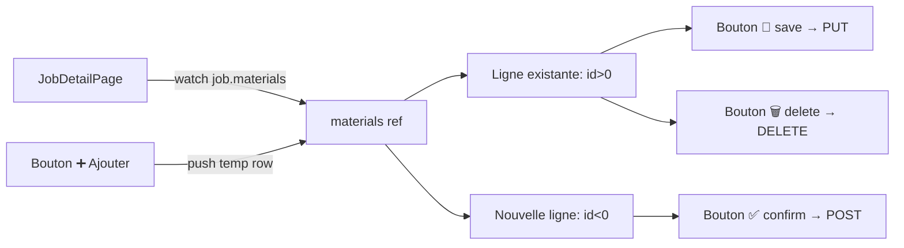

# INT-28 — Frontend MaterialsForm

> **Objectif** : Activer l'onglet Matériaux dans JobDetailPage avec formulaire inline
> **Stack** : Vue 3 + PrimeVue InputText + materialsApi (déjà prêt depuis INT-27)

---

## 1. Ce qui a été fait

| Fichier                       | Action                                   |
| ----------------------------- | ---------------------------------------- |
| `src/pages/JobDetailPage.vue` | Onglet Matériaux activé avec CRUD inline |

L'API client (`materialsApi`) était déjà prête depuis INT-27.

---

## 2. Architecture du formulaire



---

## 3. Gestion des IDs temporaires

```ts
let tempIdCounter = 0;

function addRow() {
  tempIdCounter--; // -1, -2, -3...
  materials.value.push({ id: tempIdCounter, name: "", quantity: null });
}
```

**Pourquoi des IDs négatifs ?** Les nouveaux matériaux n'ont pas encore d'ID tant qu'ils ne sont pas sauvegardés en DB. Un ID négatif permet de :

- Différencier `v-if="mat.id < 0"` (nouveau) → bouton ✅ vert
- VS `v-else` (existant) → bouton 💾 bleu

---

## 4. Cycle de vie

```ts
// Chargement : watch sur job.materials
watch(
  () => job.value?.materials,
  (mats) => {
    if (mats) materials.value = mats.map((m) => ({ id: m.id, name: m.name, quantity: m.quantity }));
  },
  { immediate: true },
);

// Création : remplace l'ID temporaire par l'ID réel
async function addMaterial(mat) {
  const created = await materialsApi.add(token, jobId, { name: mat.name, quantity: mat.quantity });
  mat.id = created.id; // ← l'ID temporaire devient l'ID réel
}

// Suppression : retire du tableau local
async function deleteMaterial(id) {
  await materialsApi.remove(token, jobId, id);
  materials.value = materials.value.filter((m) => m.id !== id); // ← mise à jour locale immédiate
}
```

---

## 5. 🎉 Sprint 2.1 terminé ! (7/7 ✅)

| Tâche                               | Statut |
| ----------------------------------- | ------ |
| INT-22 — JobPhoto + Material models | ✅     |
| INT-23 — POST upload photo          | ✅     |
| INT-24 — DELETE photo               | ✅     |
| INT-25 — Material model             | ✅     |
| INT-26 — CRUD Materials API         | ✅     |
| INT-27 — Frontend Upload photo      | ✅     |
| INT-28 — Frontend MaterialsForm     | ✅     |

### Todos débloqués

- **TD-F003** (JobDetailPage onglets) : ✅ Fait — Photos, Matériaux, Checklist actifs. Reste Rapport (`:disabled`).
